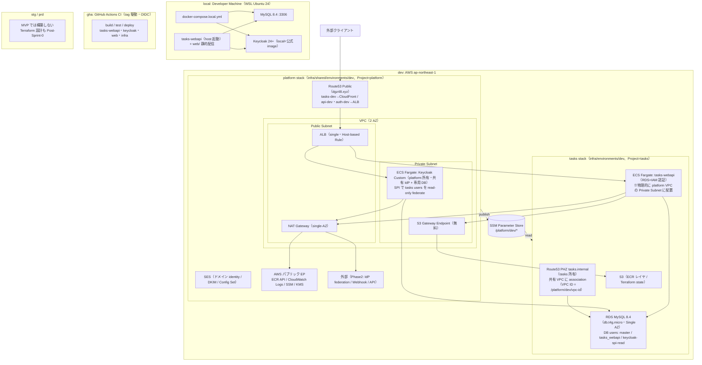
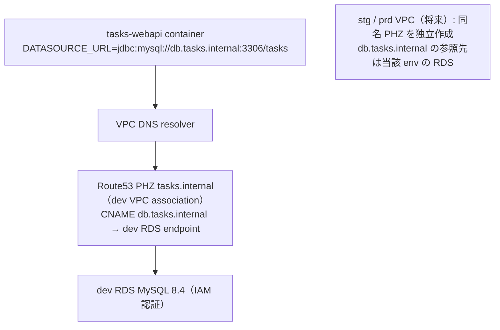

# Phase 1 Sprint 0 着手前基盤整備 + 実装フェーズ Infra 計画(v5)

**策定日**: 2026-05-23(v1〜v4 同日策定)/ **v5 = 2026-05-23**(構造再編: Setup 命名統一 + Stage 2A/2B/2C/3 を Sprint X Infra に再配置)
**Phase 1 Sprint 0 着手予定**: **2026-06-14**(v4 の 2026-07-14 から 1 ヶ月前倒し)
**基盤整備フェーズ**: 3 週間(2026-05-23 〜 2026-06-13、Phase 1 Setup 0/1/2)
**実装フェーズ**: Sprint 0-1 実績完了(2026-06-07)、Sprint 2-5 は **2026-06-08 〜 2026-07-19** に前倒し改訂(開発計画書 v1.4)
**担当**: win2cot(全ストリーム単独)
**MVP リリース時の対象環境**: **local + gha + dev のみ**(stg / prd は構築せず、Terraform 設計も Post-Sprint-0 に延期)

## v4 → v5 主要変更点

| # | v4 | v5 |
|---|---|---|
| 1 | Stage 0-3(7.5 週間)を完了させてから Phase 1 Sprint 0(2026-07-14)着手 | **基盤整備フェーズ(Phase 1 Setup 0-2、3 週間)** で Phase 1 Sprint 0 着手の必要条件のみ整備 → **Phase 1 Sprint 0 開始 2026-06-14 に前倒し**(1 ヶ月) |
| 2 | Stage と Sprint の混在で読みづらい | **Phase 1 Setup 0/1/2**(基盤整備)と **Phase 1 Sprint 0-5(App + Infra 並行)** に統一 |
| 3 | Stage 2A/2B/2C/3 を Phase 1 Sprint 0 前に直列消化 | **Phase 1 Sprint 0-5 の Infra ストリーム** に再配置(各 Sprint で App と並行) |
| 4 | Keycloak SPI 設計 ADR は Stage 2B 内に埋め込み | **Phase 1 Setup 2** として独立(基盤整備フェーズの必須クリティカルパス) |
| 5 | MVP リリース見込み: 2026-11-21(開発計画書 v1.2 通り) | **MVP リリース見込み: 2026 年 10 月下旬〜11 月上旬**(開発計画書 v1.3 §4.1 を 1 ヶ月前倒し改訂) |

## 1. 目的とスコープ

### 1.1 基盤整備フェーズ(Phase 1 Setup 0-2、Phase 1 Sprint 0 着手のクリティカルパス、3 週間)

Phase 1 Sprint 0 着手の **本当の必要条件** は以下 3 つのみ:

1. **Phase 1 Setup 0(W0、2026-05-23 〜 2026-05-30)**: monorepo 構造整理 — `webapi/` `web/` `keycloak/` `infra/` の subdir 構造に既存資材を移動。Phase 1 Sprint 0 で scaffold ↔ 設計書整合実装が `webapi/` 配下で動くようにする
2. **Phase 1 Setup 1(W1-W2、2026-05-31 〜 2026-06-13)**: ローカル開発環境 — Docker Compose(MySQL 8.4 + Keycloak)+ `application.yml` 単一化 + `web/` skeleton。Phase 1 Sprint 0 の Flyway / JPA / OAuth2 を WSL ローカルで実装・実行・検証可能にする
3. **Phase 1 Setup 2(W1-W2 並行、2026-05-31 〜 2026-06-13)**: Keycloak User Storage SPI 設計 ADR — 既存 users 接続経路 / read/write 方向を確定(Phase 1 Sprint 1 Infra で Custom Image を実装する前の方針確定)

### 1.2 実装フェーズ(Phase 1 Sprint 0-5、App + Infra 並行 2 ストリーム、10 週間)

実装フェーズは Sprint 単位で **App ストリーム + Infra ストリーム** を並行で進める:

- **App ストリーム**: tasks-webapi のアプリケーションコード(scaffold ↔ 設計書整合、機能実装、テスト)
- **Infra ストリーム**: AWS リソース(Terraform / Keycloak Custom Image / deploy CI/CD / dev E2E / runbook)

各 Sprint の詳細は §6 に。

### 1.3 Post-Sprint-0 に延期

- **stg / prd の Terraform 設計**: `environments/stg/`, `environments/prd/` + variables + 差分 ADR(MVP リリース後の別フェーズで対応)

### 1.4 並行ストリーム(別議論で進める)

- **ログ基盤選定 ADR**(CloudWatch Logs / Loki / OpenSearch / S3+Athena 等)— Phase 1 Sprint 1 Infra 着手までに方針確定が望ましい
- **NIST SP 800-53 MVP scope 確定**(5 ファミリ × 各 1〜2 control)— Phase 1 Sprint 4 Infra で本格整備、初期版は Phase 1 Setup 1 中に下書き

(DBA「既存 users」設計 ADR は v4 までは「並行ストリーム」だったが、v5 では **Phase 1 Setup 2 として基盤整備フェーズに格上げ**。Phase 1 Sprint 1 Infra での Keycloak Custom Image 実装の前提条件であるため)

### 1.5 開発計画書(`docs/specs/開発計画書.md`)v1.3 との関係

本計画書は **Phase 1 Sprint 0 着手前基盤整備フェーズ + 実装フェーズ Infra ストリーム** の現場向け実行計画であり、プロジェクト全体の公式計画書(`docs/specs/開発計画書.md` v1.4)の **補助文書** として位置付ける。

| 軸 | 開発計画書(v1.4) | 本計画書(v5) |
|---|---|---|
| スコープ | プロジェクト全体(2026-05 〜 2026-10/11、7 フェーズ) | 基盤整備フェーズ(W0-W2) + 実装フェーズの Infra ストリーム(W3-W12) |
| 想定読者 | ステークホルダー / 公式承認 | 現場(= win2cot 自身)/ 実装ロードマップ |
| 粒度 | フェーズ単位 / 役割単位 / コスト単位 | Setup / Sprint 単位 / Issue 単位 / Iteration 単位 |
| 一意の正本 | プロジェクトスコープ / コスト / 体制 / 環境定義 / CI-CD 全体方針 / Phase 1 Sprint 0-5 App ストリーム概略 | Phase 1 Setup 0-2 詳細 + Phase 1 Sprint 0-5 Infra ストリーム詳細 + Issue 起票一覧 |

#### 開発計画書 v1.3 への in-place 反映(2026-05-23、v1.3 のまま中身を再編)

| 箇所 | v1.3 旧(v4 整合) | v1.3 新(v5 整合) |
|---|---|---|
| §4.1 全体スケジュール | 実装 2026-07-14 〜 2026-09-12 / 結合 9/15-10/3 / UAT 10/6-10/31 / 本番 11/4-11/21 | 実装 Sprint 0-1 実績完了(2026-06-07)、Sprint 2-5: **2026-06-08 〜 2026-07-19** に前倒し(開発計画書 v1.4 §4.3.1) |
| §4.3.1 実装フェーズ | Phase 1 Sprint 0-5 を flat list | **Phase 1 Setup 0/1/2(基盤整備)+ Phase 1 Sprint 0-5(App + Infra 並行)** に再編 |
| §3.1 体制図 | 想定体制(6 名)+ 実体制(win2cot 単独) | 変更なし |
| §11.1 / §11.2 / §12 | 5 環境 / tag 駆動 / Parameter Store | 変更なし |

開発計画書 v1.3 の改訂履歴行は「実体制 / 5 環境 / tag 駆動 / Parameter Store / Setup-Sprint 構造再編」と統合して維持。

## 2. 確定前提(2026-05-23 議論で確定した 19 項目)

v4 から内容変更なし(構造再編は §1.2 にのみ影響):

| # | 項目 | 確定内容 |
|---|---|---|
| 1 | 環境階層 | local / gha / dev / stg / prd の 5 層。**MVP リリース時は local + gha + dev のみ稼働** |
| 2 | ALB | **1 ALB**、Host-based Listener Rule で振り分け |
| 3 | フロントエンド | **Bootstrap 5 + 素 JS の軽量 SPA**(D 案)、S3 + CloudFront 配信 |
| 4 | ドメイン | `tasks.dgz48.xyz` 系。`dgz48.xyz` は同 AWS アカウントの Route53 で管理済 |
| 5 | Spring プロファイル | **不使用**。env vars 注入で環境差を吸収(Native Image 対応の伏線) |
| 6 | コンテナイメージ | **全環境共通**、環境別ファイル同梱せず |
| 7 | Terraform 実行 | **GitHub Actions OIDC 経由**(手元 apply しない) |
| 8 | CI/CD トリガ | **tag 駆動**(`vX.Y.Z-dev` / `vX.Y.Z-stg` / `vX.Y.Z`) |
| 9 | シークレット管理 | **Parameter Store SecureString**(Secrets Manager は不使用、コスト面) |
| 10 | tag 命名 | **SemVer + 環境 suffix**(`v1.0.0-dev` / `v1.0.0-stg` / `v1.0.0`、SemVer 2.0 pre-release 整合) |
| 11 | RDS 認証 | **tasks-webapi: IAM 認証**(AWSAuthenticationPlugin)、**Keycloak: パスワード認証**(K-A 案)。master password は Parameter Store(DBA 業務用、アプリ非使用) |
| 12 | Phase 用語 | 本計画は **Phase 1 Setup 0/1/2 + Phase 1 Sprint 0-5(App/Infra 並行)** に統一(Stage は廃止、プロジェクト Phase 2 = MVP 後 との衝突回避) |
| 13 | リポジトリ構成 | **1 リポ monorepo**(`tasks-webapi` に集約) |
| 14 | ディレクトリ構造 | **ルートから 1 階層掘る**(`webapi/` / `web/` / `keycloak/` / `infra/` の subdir 構造)。Renovate は多 path 対応 |
| 15 | Keycloak custom module | **`keycloak/` 配下に独立 Gradle project + Custom Docker Image** |
| 16 | DBA「既存 users」 | **Keycloak User Storage SPI が外部 users テーブルを参照する設計**。ADR(対象 DB / 接続経路 / 更新方向)は **Phase 1 Setup 2** で確定 |
| 17 | ドキュメント配置 | **案 A**(横断 docs は `docs/specs/` `docs/adr/` `docs/architecture/`、IaC 固有は `infra/docs/`) |
| 18 | スケジュール | 基盤整備 3 週間 + 実装フェーズ(Sprint 0-1 実績完了 2026-06-07、Sprint 2-5: 2026-06-08 〜 2026-07-19 前倒し)。**Phase 1 Sprint 0 開始 2026-06-14**(v4 の 7/14 から 1 ヶ月前倒し)、v1.4 でさらに前倒し |
| 19 | 新規追加 Issue | リポ構造整理 PR(Phase 1 Setup 0)+ Keycloak custom 関連(Phase 1 Setup 2 ADR + Phase 1 Sprint 1 Infra 雛形 + Custom Image + CI/CD) |

## 3. システム構成(MVP リリース時)

### 3.1 環境別構成図



> **stack 所有**(ADR-0004): **platform stack** = VPC / Subnet / NAT / S3 GW EP / ALB / SES / Keycloak runtime(共有 IdP + 専用 DB)。**tasks stack** = ECS(tasks-webapi) / RDS / Frontend / PHZ `tasks.internal` / SG-ECS・RDS / ECR / `/tasks/*` Parameter Store。Keycloak runtime は platform 管理だが **`users` 表(user データ SoT)と per-realm SPI は tasks 所有**(SPI は profile read-only federate + email のみ writable、ADR-0006 改訂)。tasks は platform 出力を SSM(`/platform/dev/*`)経由で参照する(§3.5)。

### 3.2 単一 ALB + Host-based Listener Rule

| 優先順 | Host | Forward 先 |
|---|---|---|
| 1 | `api-dev.tasks.dgz48.xyz` | tasks-webapi target group |
| 2 | `auth-dev.dgz48.xyz`(中立・共有 IdP) | platform Keycloak Custom target group |
| (ALB 経由しない) | `tasks-dev.dgz48.xyz` | CloudFront → S3 |

### 3.3 リポジトリ構成(1 リポ monorepo)

```text
tasks-webapi/(repo root)
├─ webapi/                  # Spring Boot バックエンド(現状の src/ 等を移動)
│   ├─ src/main/java/...    # クリーンアーキ 4 層
│   ├─ src/main/resources/
│   │   ├─ application.yml         # 単一、環境差は env vars
│   │   └─ db/migration/           # Flyway
│   ├─ build.gradle
│   └─ Dockerfile                  # tasks-webapi(全環境共通)
│
├─ web/                     # フロントエンド(Bootstrap 5 + 素 JS SPA)
│
├─ keycloak/                # Keycloak Custom(独立 Gradle project)
│   ├─ src/main/java/...           # User Storage SPI 等
│   ├─ src/main/resources/META-INF/services/...
│   ├─ build.gradle               # Spring とは別ビルド
│   ├─ Dockerfile                  # Custom Image(公式 + SPI JAR)
│   └─ realm-export/               # Realm JSON export
│
├─ infra/                   # Terraform IaC(platform / tasks の 2 stack に分割、ADR-0004)
│   ├─ shared/                     # platform stack(Project=platform、key = platform/dev/terraform.tfstate)
│   │   ├─ environments/dev/       # main.tf / backend.tf / versions.tf + SSM publish(/platform/dev/*)
│   │   │                          # リソース命名: platform-dev-<resource>、タグ Project=platform
│   │   └─ modules/                # network / alb / ses / keycloak(共有 IdP runtime、ADR-0004 §3.E)
│   ├─ environments/
│   │   └─ dev/                    # tasks stack(Project=tasks、key = tasks/dev/terraform.tfstate)
│   │                              # platform 値は aws_ssm_parameter data source(/platform/dev/*)で参照
│   │                              # リソース命名: tasks-dev-<resource>、タグ Project=tasks
│   │                              # stg / prd は空ディレクトリを作らず(ADR-0002 §3.B)
│   ├─ modules/                    # tasks: security_group(SG-ECS/RDS) / route53 / parameter_store /
│   │                              # ecs_cluster / webapi_service / rds / frontend / ecr
│   │                              # (network / alb / keycloak は shared/ へ移動)
│   └─ docs/                       # IaC 固有 docs(adr/ 含む、ADR-0002〜ADR-0004)
│
├─ api/openapi.yaml
├─ docs/                    # 横断ドキュメント
│   ├─ specs/                      # 要件 / 基本設計 / 開発計画 / 規約
│   ├─ adr/                        # 横断 ADR
│   ├─ architecture/               # 横断アーキ図 / 本計画書
│   ├─ reviews/                    # 設計レビューログ
│   └─ dev/                        # 開発者向け運用 docs
│
├─ docker-compose.local.yml
├─ .github/workflows/(ci, deploy-* x4, claude-* shim)
├─ renovate.json            # 多 path packageRules
└─ settings.gradle          # multi-project: webapi + keycloak
```

### 3.4 環境変数による設定注入(Spring プロファイル不使用)

`webapi/src/main/resources/application.yml` は単一。環境差は ECS Task Definition の `environment` / `secrets` で注入。

```yaml
# webapi/src/main/resources/application.yml(共通)
spring:
  datasource:
    url: ${DATASOURCE_URL}
    username: ${DATASOURCE_USERNAME}
    # password は IAM 認証で動的取得(§3.6 参照)
  security:
    oauth2:
      resourceserver:
        jwt:
          issuer-uri: ${OIDC_ISSUER_URI}
```

dev の ECS Task Definition(抜粋、Terraform):

```hcl
environment = [
  { name = "DATASOURCE_URL",      value = "jdbc:mysql://db.tasks.internal:3306/tasks?useSSL=true&connectionTimeZone=SERVER&forceConnectionTimeZoneToSession=true" },
  { name = "DATASOURCE_USERNAME", value = "tasks_webapi" },
  { name = "OIDC_ISSUER_URI",     value = "https://auth-dev.dgz48.xyz/realms/tasks" },
  # JVM・CI・DB すべて Asia/Tokyo に揃える(コーディング規約 §12.1、Issue #265)
  # OS 経由で JVM デフォルト TZ を JST に
  { name = "TZ",                  value = "Asia/Tokyo" },
  # JVM 側でも明示し、base image / OS の差異に依存させない(二重強制)
  { name = "JAVA_TOOL_OPTIONS",   value = "-Duser.timezone=Asia/Tokyo" }
]
# tasks-webapi は IAM 認証なので password の secrets 注入は不要
# Keycloak の password 注入は keycloak service の Task Definition で別途設定
```

local 開発時は Docker Compose で同名 env vars を export、または `.env.local` から読む。Native Image 化(Phase 1 Setup 2 ADR-0008)時も Spring プロファイル不使用前提を継承。

### 3.5 ネットワーク(platform 所有 VPC + tasks SSM 参照)

VPC / NAT / S3 GW EP は **platform stack** が所有・管理し、tasks stack は SSM Parameter Store を介して参照する。

#### ネットワーク所有区分

| リソース | 所有 stack | SSM key(`/platform/dev/...`) |
|---|---|---|
| VPC（2 AZ） | platform | `vpc-id` / `vpc-cidr` |
| Public Subnet / Private Subnet | platform | `public-subnet-ids` / `private-subnet-ids` |
| NAT Gateway(single-AZ) + EIP | platform | — |
| S3 Gateway Endpoint(無料) | platform | — |
| ALB + SG-ALB + base cert(`*.dgz48.xyz`) | platform | `alb-arn` / `alb-https-listener-arn` / `alb-sg-id` / `alb-dns-name` / `alb-zone-id` |
| Route53 PHZ `tasks.internal` | **tasks** | VPC ID は `/platform/dev/vpc-id` を SSM で参照 |
| SG-ECS / SG-RDS | **tasks** | ALB SG は `/platform/dev/alb-sg-id` を SSM で参照 |
| ECS Fargate: tasks-webapi | **tasks** | Subnet ID は `/platform/dev/private-subnet-ids` を参照 |
| RDS MySQL 8.4 | **tasks** | Subnet ID は `/platform/dev/private-subnet-ids` を参照 |

#### NAT Gateway(ADR-0003)

dev は **単一 NAT Gateway(single-AZ) + S3 Gateway Endpoint(無料)** を採用。  
dev の低トラフィックでは VPC Interface Endpoint 群(≈$51/月)より NAT(≈$45/月)が安く、Phase 2 の外部 outbound(federation / webhook)にも初めから対応できる。S3 GW EP(無料)が ECR レイヤ pull / 一般 S3 を NAT から迂回させデータ処理費を圧縮する。詳細は `infra/docs/adr/0003-private-subnet-outbound.md`。

#### Route53 PHZ と VPC association(ADR-0001)

PHZ `tasks.internal` は tasks stack が所有するが、**platform 所有 VPC への association が必要**。tasks の Terraform は `/platform/dev/vpc-id`(SSM)を `aws_ssm_parameter` data source で読み、`aws_route53_zone_association` で共有 VPC に関連付ける。詳細は `infra/docs/adr/0001-private-dns-for-rds.md`。

### 3.6 RDS 認証(K-A 案、MySQL 8.4)

DB エンジンは **RDS MySQL 8.4**(Phase 1 Setup 2 ADR で確定、Aurora は Post-Sprint-0 で再評価)。

| 利用者 | 認証方式 | 理由 |
|---|---|---|
| **tasks-webapi** | IAM 認証(`AWSAuthenticationPlugin`) | パスワード管理不要、IAM Role 短命トークン |
| **Keycloak SPI federation 用 read user** | パスワード認証(PS、read-only) | platform Keycloak が SPI で tasks `users` を read federate するための tasks RDS 上の read-only user。**Keycloak 自身の DB は platform 専用 Keycloak DB(#387、ADR-0004 改訂)** で tasks RDS ではない |
| **master(DBA 業務)** | パスワード認証(PS から取得) | アプリ非使用、緊急 / 障害時 |

Parameter Store(代表例、完全な一覧は **`docs/architecture/parameter-store.md`** に集約):

- `/tasks/dev/db/master-password`(DBA 用、回転 = 手動)
- `/tasks/dev/db/keycloak-spi-read-password`(Keycloak SPI federation 用 read-only user、回転 = 手動)。Keycloak 自身の DB credential は platform 側(`/platform/dev/...`、#387)

RDS は Terraform で `iam_database_authentication_enabled = true` を設定し、tasks-webapi の DB user 作成時に `AWSAuthenticationPlugin` で IAM 認証可能化。

### 3.6.1 Private DNS で RDS エンドポイント固定化(Phase 1 Setup 2 ADR で採用、env 毎独立 PHZ)

各 env(dev / stg / prd)の VPC に **同名の Private Hosted Zone `tasks.internal`** を独立して作成し、VPC association で当該 VPC からのみ参照可能にする。record 名は env 不問で統一(`db.tasks.internal` 等)。



**メリット**:

- env 切替時にアプリ ENV 不変 + コンテナイメージ全環境共通(本計画の確定前提 #6)が完全に活きる
- Aurora 移行 / エンジン切替 / インスタンスリネーム時もアプリ ENV 不変
- VPC 境界が PHZ 境界と一致、env 間の DNS 漏洩リスクなし

コスト: 各 VPC で Route53 PHZ $0.50/月 + クエリ料(ほぼ 0)。詳細は `infra/docs/adr/0001-private-dns-for-rds.md`(Setup2-3)。

#### Public DNS との関係

| 種別 | Zone 例 | 用途 |
|---|---|---|
| Public(`dgz48.xyz` Route53 hosted zone) | `tasks-dev.dgz48.xyz` / `api-dev.tasks.dgz48.xyz`(tasks) + `auth-dev.dgz48.xyz`(中立・共有 IdP、platform) | 外部から ALB / CloudFront にアクセス。tasks 深い cert(`*.tasks.dgz48.xyz`)+ 共有 IdP host(platform base cert)で host カバー |
| Private(各 env VPC PHZ `tasks.internal`) | `db.tasks.internal`(将来: `cache.tasks.internal` 等)| VPC 内部からのみアクセス、env 不問の名前で全環境共通 ENV を実現 |

### 3.7 Keycloak Custom Image(`keycloak/` subdir)

独立 Gradle project として `keycloak/src/main/java/` 配下に User Storage SPI 等を実装、`META-INF/services/` で SPI 登録、`keycloak/build.gradle` で JAR を生成。

`keycloak/Dockerfile`(全環境共通、公式 Keycloak image + 自作 SPI JAR の 2 段ビルド):

```dockerfile
FROM quay.io/keycloak/keycloak:24.0 AS builder
COPY build/libs/keycloak-tasks-spi-*.jar /opt/keycloak/providers/
RUN /opt/keycloak/bin/kc.sh build

FROM quay.io/keycloak/keycloak:24.0
COPY --from=builder /opt/keycloak/ /opt/keycloak/
ENTRYPOINT ["/opt/keycloak/bin/kc.sh", "start"]
```

ECR には `keycloak-custom` リポジトリを別途用意し、`vX.Y.Z-dev` tag で push → ECS Service が pull。

「DBA: 既存 users 参照」は **この SPI から既存 users テーブルへ read 接続する** 形になる(**Phase 1 Setup 2** で ADR 化、`docs/adr/0006-keycloak-user-storage-spi.md`)。

## 4. タイムライン(Phase 1 Setup 0-2 + Phase 1 Sprint 0-5)

```text
[基盤整備フェーズ(3 週間、2026-05-23 〜 2026-06-13)]

W0  5/23 (土)  Phase 1 Setup 0:  monorepo 構造整理
W1  5/31 (日)  Phase 1 Setup 1:  ローカル開発環境
W2  6/07 (日)  Phase 1 Setup 1 (続) + Phase 1 Setup 2: Keycloak User Storage SPI 設計 ADR

[実装フェーズ — App + Infra 並行]

W3-W4   Phase 1 Sprint 0 (2w、6/14〜6/27、実績: 前倒し完走)
        ├─ Phase 1 Sprint 0 App:    scaffold ↔ 設計書整合実装(#121)
        └─ Phase 1 Sprint 0 Infra:  Terraform 基盤(state, OIDC IAM Role,
                            VPC + SG + ALB 雛形, Parameter Store)

W5-W6   Phase 1 Sprint 1 (2w、6/28〜7/11、実績: 2026-06-07 完走 #302)
        ├─ Phase 1 Sprint 1 App:    OIDC 強化, user_tenants 完成, テナント切替 UI
        └─ Phase 1 Sprint 1 Infra:  AWS dev リソース(RDS IAM, ECS, Keycloak Custom,
                            Route53/ACM, ECR, Realm import)

W2-W3   Phase 1 Sprint 2 (2w、6/08〜6/21)       ← v1.4 前倒し
        ├─ Phase 1 Sprint 2 App:    タスク CRUD 仕上げ, 関係者
        └─ Phase 1 Sprint 2 Infra:  deploy CI/CD(各コンポーネント tag 駆動)

W4-W5   Phase 1 Sprint 3 (2w、6/22〜7/05)       ← v1.4 前倒し
        ├─ Phase 1 Sprint 3 App:    当日タスク, 日付切替, 期限切れ, 優先度, 検索
        └─ Phase 1 Sprint 3 Infra:  dev E2E, クロステナント先行テスト, ログ基盤実装

W6      Phase 1 Sprint 4 (1w、7/06〜7/12)       ← v1.4 前倒し
        ├─ Phase 1 Sprint 4 App:    ダッシュボード, 通知バッチ, 監査ログ
        └─ Phase 1 Sprint 4 Infra:  運用 runbook 初版, NIST MVP control 整備

W7      Phase 1 Sprint 5 (1w、7/13〜7/19)       ← v1.4 前倒し
        ├─ Phase 1 Sprint 5 App:    クロステナント漏洩テスト, 認可テスト, 性能チューニング
        └─ Phase 1 Sprint 5 Infra:  最終調整, リリース前チェックリスト

[結合テスト〜本番移行(開発計画書 v1.4 §4.1)]
W8- 2026-07-21 〜 結合テスト → UAT → 本番移行
```

並行ストリーム(全期間):

- ログ基盤選定 ADR(Phase 1 Sprint 1 Infra までに方針確定が望ましい)
- NIST SP 800-53 MVP 初期下書き(Phase 1 Setup 1 中)、本格整備は Phase 1 Sprint 4 Infra

## 5. 基盤整備フェーズ詳細(W0-W2、Phase 1 Sprint 0 着手のクリティカルパス)

### 5.1 Phase 1 Setup 0: monorepo 構造整理(W0、2026-05-23 〜 2026-05-30)

#### 目的

リポルートに散在している既存資材(`src/` / `build.gradle` / `gradlew` / `api/` / `docs/` 等)を `webapi/` サブディレクトリへ集約し、`web/` / `keycloak/` / `infra/` の配置先を確保する。1 PR ですべて移動(Renovate / CI workflow パス変更も同時実施)。

#### サブタスク(Issue 化候補)

| # | サブタスク | claude-automation 適用 | Iteration |
|---|---|---|---|
| Setup0-1 | infra(repo): monorepo 構造整理 PR(`webapi/` 等 subdir + 資材移動 + CI workflow パス更新) | 半適用 | Phase 1 Setup 0 |
| Setup0-2 | infra(ci): Renovate `packageRules` 多 path 対応(`webapi/**` `keycloak/**` `infra/**` `web/**`) | 適用 | Phase 1 Setup 0 |
| Setup0-3 | docs(architecture): 本計画書(v5)+ tracker Issue を commit | 適用 | Phase 1 Setup 0 |

#### 受入条件

- [ ] `webapi/` `web/` `keycloak/` `infra/` の 4 subdir が存在
- [ ] 既存資材が `webapi/` 配下に移動済
- [ ] `./gradlew :webapi:build` 成功(multi-project Gradle 構成)
- [ ] CI workflow が新しい path で動作
- [ ] Renovate が path 別ラベルで PR 作成
- [ ] `./gradlew :webapi:bootRun` で Spring Boot アプリが起動

### 5.2 Phase 1 Setup 1: ローカル開発環境(W1-W2、2026-05-31 〜 2026-06-13)

#### 目的

Phase 1 Sprint 0(#121「scaffold ↔ 設計書整合実装」)で実装する P0 タスク(#83 / #84 / #85 / #87 / #88 / #89 等)が **WSL ローカルで実装・実行・検証可能** になる状態を達成する。MySQL 8.4 + Keycloak が Docker Compose で起動し、`application.yml` 単一化 + env vars 注入の枠組み + `web/` 雛形が完成。

#### サブタスク

| # | サブタスク | claude-automation 適用 | Iteration |
|---|---|---|---|
| Setup1-1 | infra(compose): `docker-compose.local.yml` 雛形(MySQL 8.4 + Keycloak 公式 image) | 適用 | Phase 1 Setup 1-2 |
| Setup1-2 | infra(compose): Keycloak Realm 設計(`tasks` realm、Roles、Test Users、Client)+ JSON export 配置(`keycloak/realm-export/`) | 半適用 | Phase 1 Setup 1-2 |
| Setup1-3 | infra(compose): MySQL 初期化 + Flyway 起動確認 | 適用 | Phase 1 Setup 1-2 |
| Setup1-4 | infra(app): `application.yml` 単一化 + env vars 注入の枠組み | 適用 | Phase 1 Setup 1-2 |
| Setup1-5 | infra(web): `web/` ディレクトリ雛形(`index.html` + Bootstrap 5 + 認証 JS) | 適用 | Phase 1 Setup 1-2 |
| Setup1-6 | docs(dev): ローカル開発セットアップガイド(`docs/dev/local-setup.md`) | 適用 | Phase 1 Setup 1-2 |
| Setup1-7 | infra(compose): E2E 動作確認手順 + ログ証跡 | 半適用 | Phase 1 Setup 1-2 |

#### 受入条件

- [ ] `docker compose -f docker-compose.local.yml up -d` で MySQL 8.4 + Keycloak が立ち上がる
- [ ] Keycloak admin console で `tasks` realm + roles + test users 定義済み
- [ ] `./gradlew :webapi:bootRun` で env vars 注入された tasks-webapi が起動
- [ ] `web/index.html` から Keycloak 経由ログイン → API call 成功
- [ ] Flyway が起動時に migration を実行
- [ ] ローカルセットアップガイドが整備

### 5.3 Phase 1 Setup 2: Phase 1 Sprint 0 着手前の設計 ADR 群(W1-W2 並行、2026-05-31 〜 2026-06-13)

#### 目的

Phase 1 Sprint 0 のアプリ実装 / Phase 1 Sprint 0-1 Infra の AWS 構築に先立って確定しておくべき **設計判断 ADR 4 件** を起票・承認する。これらは Phase 1 Sprint 0 着手の **前提条件**。

#### 対象 ADR

| ADR | 配置 | 議論ポイント |
|---|---|---|
| Keycloak User Storage SPI 設計 | `docs/adr/0006-keycloak-user-storage-spi.md`(横断) | 対象 DB / 接続経路(直接 JDBC or 既存 API)/ 更新方向(初期 read のみ)/ 同期方針 / API 互換性 |
| RDS MySQL vs Aurora | `docs/adr/0007-rds-mysql-vs-aurora.md`(横断) | dev は RDS MySQL 8.4 で確定(コスト ~$15/月 vs Aurora ~$43/月、testcontainers 完全互換、ベンダーロックイン回避)。prd 構築時(Post-Sprint-0)に再評価 |
| GraalVM Native Image 採用 | `docs/adr/0008-graalvm-native-image.md`(横断) | Fat JAR とのトレードオフ(起動時間 / メモリ / ビルド複雑化 / Reflection 制約 / `@RegisterReflectionForBinding` 等)。Spring プロファイル不使用の理由を本 ADR で集約 |
| Private DNS for RDS | `infra/docs/adr/0001-private-dns-for-rds.md`(IaC 固有) | Route53 Private Hosted Zone で `db.tasks.internal`(env 不問、§3.6.1)の CNAME を被せ、Aurora 移行 / エンジン切替時のアプリ ENV 不変を実現 |

(ADR 番号は既存 0001-0005 のあとに 0006/0007/0008 として続く。実起票時に再確認)

#### サブタスク

| # | サブタスク | claude-automation 適用 | Iteration |
|---|---|---|---|
| Setup2-1 | design(dba/keycloak): Keycloak User Storage SPI 設計 ADR | 半適用 | Phase 1 Setup 1-2 |
| Setup2-2 | design(db): RDS MySQL vs Aurora 選定 ADR | 半適用 | Phase 1 Setup 1-2 |
| Setup2-3 | design(network): Private DNS for RDS 採否 ADR(IaC 固有、`infra/docs/adr/`) | 半適用 | Phase 1 Setup 1-2 |
| Setup2-4 | design(runtime): GraalVM Native Image 採用 ADR + `docs/specs/コーディング規約.md` に Native Image 実装制約セクション追記(Reflection ヒント / `@RegisterReflectionForBinding` 等) | 半適用 | Phase 1 Setup 1-2 |

#### 受入条件

- [ ] 4 件の ADR がすべて起票 + 承認済(self-review)
- [ ] コーディング規約.md に Native Image 実装制約セクションが追加され、Phase 1 Sprint 0 App 実装時の指針となる
- [ ] Phase 1 Sprint 0-1 Infra(Terraform 基盤 / RDS / Keycloak Custom Image)着手時に参照可能な状態

## 6. 実装フェーズ詳細(Phase 1 Sprint 0-5、App + Infra 並行)

各 Sprint は **App ストリーム + Infra ストリーム** で並行進行。各 Sprint 末に統合動作確認(local または dev、Sprint による)。

App ストリームの詳細(機能実装)は `docs/specs/開発計画書.md` v1.3 §4.3.1 を正本とする。本計画書では Infra ストリームの詳細を記述し、App ストリームは概略のみ。

### 6.1 Phase 1 Sprint 0(W3-W4、2026-06-14 〜 2026-06-27、2 週間)

#### Phase 1 Sprint 0 App: scaffold ↔ 設計書整合実装(#121 配下)

既存 scaffold(`webapi/src/main/java/xyz/dgz48/tasks/webapi/`、33 ファイル)と設計書 v1.4.x の差分を解消。詳細は `docs/reviews/2026-05-10-scaffold-vs-design-gap-analysis.md`。

主な実装:

- クリーンアーキ 4 層リファクタ(Domain / UseCase / Adapter / Infra)
- `tasks` テーブル拡張(`tenant_id` / `priority` / `visibility` / `assignee_id` / `due_date` / `completed_at` / `deleted_at` / `created_at` / `updated_at`、status enum 拡張、title 縮小、body→description)
- 新規テーブル: `tenants` / `user_tenants` / `task_stakeholders` / `audit_logs` / `user_notification_settings` / `shedlock`
- API 28 endpoints 実装(Controller + UseCase + Repository)
- RBAC + テナント認可(`TaskAuthorizationDomainService` 拡張)
- `application.yml` の DataSource / Flyway / OAuth2 issuer 設定
- `users` テーブル設計書補正

サブ Issue: 既存の #83-#89 等(#121 配下)、本計画書 Tracker からは参照のみ。

#### Phase 1 Sprint 0 Infra: Terraform 基盤

| # | サブタスク | claude-automation 適用 | Iteration |
|---|---|---|---|
| S0Infra-1 | infra(terraform): Terraform プロジェクト構造 ADR(`infra/modules/` `infra/environments/` `infra/docs/adr/`) | 議論先行 | Phase 1 Sprint 0 |
| S0Infra-2 | infra(terraform): (platform) 共有 state backend(S3 + `use_lockfile`、key=`platform/dev/*` と `tasks/dev/*` の 2 本、bucket=`dgz48-tfstate`)+ bootstrap 手順 | 適用(初回 S3 bucket 手動 bootstrap)| Phase 1 Sprint 0 |
| S0Infra-3 | infra(ci-cd): GitHub Actions OIDC + IAM Role(`terraform apply` 用) | 適用 | Phase 1 Sprint 0 |
| S0Infra-4 | infra(terraform): VPC + Subnets(public/private)+ IGW + Route Tables 雛形(**outbound 経路は S0Infra-9 ADR 確定後に追加**、S0Infra-9 参照)| 適用 | Phase 1 Sprint 0 |
| S0Infra-5 | infra(terraform): Security Groups(SG-ALB / SG-ECS / SG-RDS) | 適用 | Phase 1 Sprint 0 |
| S0Infra-6 | infra(terraform): ALB(single)+ HTTPS Listener 雛形 | 適用 | Phase 1 Sprint 0 |
| S0Infra-7 | infra(terraform): Parameter Store SecureString パラメータ整備 + `docs/architecture/parameter-store.md` 横断 doc 同時 commit(全 PS パラメータの階層 / 型 / アクセス許可者 / 回転ポリシー 一覧、`smtp-password` は **Keycloak の SMTP メール送信用**、ADR-0006 派生)| 適用 | Phase 1 Sprint 0 |
| S0Infra-8 | infra(terraform): Route53 Private Hosted Zone(`tasks.internal`、env 毎独立、§3.6.1)+ dev VPC association(Setup2-3 ADR 反映、RDS への CNAME placeholder) | 適用 | Phase 1 Sprint 0 |
| **S0Infra-9** | **infra(design): Private Subnet outbound 経路選定 ADR(NAT GW vs VPC Endpoint vs 他、`infra/docs/adr/0003-...`)— S0Infra-4 のブロッカー** | **議論先行** | Phase 1 Sprint 0 |

#### Phase 1 Sprint 0 受入条件(統合)

- [ ] Phase 1 Sprint 0 App: #121 配下サブ Issue が closed、`./gradlew :webapi:check` が green、UT カバレッジ 80%+
- [ ] Phase 1 Sprint 0 Infra: `terraform plan`(dev)が差分なし、state backend / OIDC IAM Role / Private Hosted Zone が動作
- [ ] `docs/architecture/parameter-store.md` が PS の階層構造を完全網羅している

### 6.2 Phase 1 Sprint 1(W5-W6、2026-06-28 〜 2026-07-11、2 週間)

#### Phase 1 Sprint 1 App

- OIDC ログイン強化(refresh token / token revocation)
- `user_tenants` 完成 + テナント切替 UI(`web/`)
- TenantContext / Hibernate Filter のチューニング + N+1 解消
- E2E テスト(`testcontainers MySQL 8.4`)整備

#### Phase 1 Sprint 1 Infra: AWS dev リソース構築

| # | サブタスク | claude-automation 適用 | Iteration |
|---|---|---|---|
| S1Infra-1 | infra(terraform): RDS MySQL 8.4(dev、db.t4g.micro、**IAM 認証有効化**)+ Private Hosted Zone へ CNAME(`db.tasks.internal` → dev RDS endpoint)登録 | 適用 | Phase 1 Sprint 1 |
| S1Infra-2 | infra(terraform): ECS Cluster(Fargate) | 適用 | Phase 1 Sprint 1 |
| S1Infra-3 | keycloak: 独立 Gradle project 雛形(SPI 用、`keycloak/`)+ Phase 1 Setup 2 ADR 反映 | 適用 | Phase 1 Sprint 1 |
| S1Infra-4 | keycloak: Custom Docker Image(公式 Keycloak + 自作 SPI JAR、**共有 platform ビルド**) | 適用 | Phase 1 Sprint 1 |
| S1Infra-5 | infra(terraform): **(platform)** Keycloak (Custom) ECS Service + Listener Rule(共有 IdP runtime + 専用 DB #387) | 適用 | Phase 1 Sprint 1 |
| S1Infra-6 | infra(terraform): Route53 + ACM(各 host、CloudFront 用は us-east-1) | 適用 | Phase 1 Sprint 1 |
| S1Infra-7 | infra(terraform): ECR(`tasks-webapi` + `keycloak-custom`) | 適用 | Phase 1 Sprint 1 |
| S1Infra-8 | infra(terraform): Keycloak Realm initial import 手順 | 半適用 | Phase 1 Sprint 1 |

#### Phase 1 Sprint 1 受入条件(統合)

- [ ] Phase 1 Sprint 1 App: テナント切替 UI が動作、`user_tenants` の全機能テスト green
- [ ] Phase 1 Sprint 1 Infra: dev 環境で RDS / ECS / Keycloak Custom が起動、Route53 + ACM 完成
- [ ] dev Keycloak(Custom Image)でログイン → JWT 取得 → tasks-webapi 簡易 API call(まだデプロイ未)を local から確認可能

### 6.3 Phase 1 Sprint 2(W2-W3、2026-06-08 〜 2026-06-21、2 週間)

#### Phase 1 Sprint 2 App

- タスク CRUD 仕上げ(visibility ロジック含む)
- 関係者(`task_stakeholders`)完成 + 認可テスト

#### Phase 1 Sprint 2 Infra: deploy CI/CD

| # | サブタスク | claude-automation 適用 | Iteration |
|---|---|---|---|
| S2Infra-1 | infra(app): tasks-webapi Dockerfile(IAM 認証クライアント設定込み、`webapi/Dockerfile`) | 適用 | Phase 1 Sprint 2 |
| S2Infra-2 | infra(terraform): tasks-webapi ECS Service + Listener Rule + Task Role(IAM 認証) | 適用 | Phase 1 Sprint 2 |
| S2Infra-3 | infra(terraform): Frontend S3 + CloudFront + ACM(us-east-1) | 適用 | Phase 1 Sprint 2 |
| S2Infra-4 | infra(ci-cd): tasks-webapi tag → ECR push + ECS update | 適用 | Phase 1 Sprint 2 |
| S2Infra-5 | infra(ci-cd): keycloak custom tag → ECR push + **(platform)** ECS update | 適用 | Phase 1 Sprint 2 |
| S2Infra-6 | infra(ci-cd): frontend tag → S3 sync + CloudFront invalidation | 適用 | Phase 1 Sprint 2 |
| S2Infra-7 | infra(ci-cd): infra tag → terraform apply | 適用 | Phase 1 Sprint 2 |

> **[S2Infra-1 実装時の注意]** monorepo 化(Setup0-1)により Spring Boot fat JAR のアーティファクト名が変更済み: `tasks-webapi-*.jar` → **`webapi-*.jar`**。Dockerfile の `COPY` パスは `webapi/build/libs/webapi-*.jar` で参照すること。

#### Phase 1 Sprint 2 受入条件(統合)

- [ ] tasks-webapi が dev で動作、API 28 endpoints 全て応答
- [ ] tag push で 4 ストリーム全て自動デプロイ
- [ ] `tasks-dev.dgz48.xyz` でフロントエンドが表示

### 6.4 Phase 1 Sprint 3(W4-W5、2026-06-22 〜 2026-07-05、2 週間)

#### Phase 1 Sprint 3 App

- 当日タスク表示、日付切替、期限切れ常時表示、優先度、検索

#### Phase 1 Sprint 3 Infra: dev E2E + ログ基盤 + コスト圧縮

| # | サブタスク | claude-automation 適用 | Iteration |
|---|---|---|---|
| S3Infra-1 | infra(dev-e2e): dev E2E 動作確認 + クロステナント先行テスト | 議論先行 | Phase 1 Sprint 3 |
| S3Infra-2 | infra(dev-e2e): パフォーマンス簡易計測(latency / connection pool / メモリ) | 半適用 | Phase 1 Sprint 3 |
| S3Infra-3 | infra(observability): ログ基盤実装(別議論 ADR 結果反映、初期 CloudWatch Logs 想定) | 適用 | Phase 1 Sprint 3 |
| S3Infra-4 | infra(scheduling): EventBridge Scheduler で dev ECS Service の desiredCount を曜日別切替(平日 19:00-02:00 / 土日 10:00-02:00、Lambda + IAM 経由 `ecs:UpdateService`)| 適用 | Phase 1 Sprint 3 |

#### Phase 1 Sprint 3 受入条件(統合)

- [ ] Phase 1 Sprint 3 App: 機能拡張全て green
- [ ] Phase 1 Sprint 3 Infra: クロステナント漏洩テスト green、ログが ログ基盤で確認可能

### 6.5 Phase 1 Sprint 4(W6、2026-07-06 〜 2026-07-12、1 週間)

#### Phase 1 Sprint 4 App

- ダッシュボード、通知バッチ、監査ログ(ハッシュチェーン)

#### Phase 1 Sprint 4 Infra: runbook + NIST

| # | サブタスク | claude-automation 適用 | Iteration |
|---|---|---|---|
| S4Infra-1 | docs(ops): 運用 runbook 初版(起動 / 停止 / 障害対応 / log 確認 / cost 節約) | 適用 | Phase 1 Sprint 4 |
| S4Infra-2 | security(nist): MVP 最小 control セット最終確認(現状ギャップ分析含む、Phase 1 Setup 1 初期版から拡張) | 半適用 | Phase 1 Sprint 4 |

### 6.6 Phase 1 Sprint 5(W7、2026-07-13 〜 2026-07-19、1 週間)

#### Phase 1 Sprint 5 App

- クロステナント漏洩テスト本実施、タスク認可テスト網羅、性能チューニング

#### Phase 1 Sprint 5 Infra: 最終調整

| # | サブタスク | claude-automation 適用 | Iteration |
|---|---|---|---|
| S5Infra-1 | infra(release): リリース前チェックリスト + MVP 仕上げ | 適用 | Phase 1 Sprint 5 |
| S5Infra-2 | docs(sprint5): MVP リリース引き継ぎメモ + Post-Sprint-0 残課題明文化 | 適用 | Phase 1 Sprint 5 |

## 7. 並行ストリーム(別議論で進める、減少)

v4 までは 3 つの並行ストリーム(NIST / ログ / DBA)があったが、v5 では構造的に各 Sprint または Setup に統合:

| 旧 並行ストリーム | v5 での扱い |
|---|---|
| DBA「既存 users」設計 ADR | **Phase 1 Setup 2 として基盤整備フェーズに格上げ**(必須クリティカルパス) |
| ログ基盤選定 ADR | Phase 1 Sprint 1 Infra 着手までに方針確定(Phase 1 Sprint 3 Infra S3Infra-3 で実装) |
| NIST SP 800-53 MVP scope 確定 | Phase 1 Setup 1 中に初期下書き、Phase 1 Sprint 4 Infra S4Infra-2 で本格整備 |

純粋な「並行ストリーム」は **ログ基盤選定 ADR の方針確定タイミング** のみ残る:

| # | サブタスク | claude-automation 適用 | Iteration |
|---|---|---|---|
| P-LOG-A | design(logging): ログ基盤選定 ADR(`infra/docs/adr/` 配下) | 半適用 | Phase 1 Sprint 1 (期限) |

## 8. Issue 起票一覧(まとめ)

すべて tasks-webapi リポへ起票。Iteration は **Phase 1 Setup 0** / **Phase 1 Setup 1-2**(Setup 1 + Setup 2 combined)/ **Phase 1 Sprint 0..5**。Milestone は廃止(2026-05-23、§11 参照)。

### 8.1 基盤整備フェーズ(Phase 1 Setup 0/1/2、14 件)

| # | 起票順 | タイトル(案) | 優先度 | Iteration |
|---|---|---|---|---|
| Setup0-1 | 1 | infra(repo): monorepo 構造整理 PR | p0 | Phase 1 Setup 0 |
| Setup0-2 | 2 | infra(ci): Renovate packageRules 多 path 対応 | p1 | Phase 1 Setup 0 |
| Setup0-3 | 3 | docs(architecture): infrastructure-plan.md v5 commit + tracker Issue 起票 | p1 | Phase 1 Setup 0 |
| Setup1-1 | 4 | infra(compose): MySQL 8.4 + Keycloak の Docker Compose スタック雛形 | p0 | Phase 1 Setup 1-2 |
| Setup1-2 | 5 | infra(compose): Keycloak Realm 設計 + JSON export 配置 | p0 | Phase 1 Setup 1-2 |
| Setup1-3 | 6 | infra(compose): MySQL 初期化 + Flyway 起動確認 | p1 | Phase 1 Setup 1-2 |
| Setup1-4 | 7 | infra(app): `application.yml` 単一化 + env vars 注入の枠組み | p0 | Phase 1 Setup 1-2 |
| Setup1-5 | 8 | infra(web): `web/` ディレクトリ雛形 + Bootstrap 5 + 認証 JS | p1 | Phase 1 Setup 1-2 |
| Setup1-6 | 9 | docs(dev): ローカル開発セットアップガイド | p2 | Phase 1 Setup 1-2 |
| Setup1-7 | 10 | infra(compose): E2E 動作確認手順 + ログ証跡 | p2 | Phase 1 Setup 1-2 |
| Setup2-1 | 11 | design(dba/keycloak): Keycloak User Storage SPI 設計 ADR(`docs/adr/0006-...`) | p0 | Phase 1 Setup 1-2 |
| Setup2-2 | 12 | design(db): RDS MySQL vs Aurora 選定 ADR(`docs/adr/0007-...`) | p0 | Phase 1 Setup 1-2 |
| Setup2-3 | 13 | design(network): Private DNS for RDS 採否 ADR(`infra/docs/adr/0001-...`) | p0 | Phase 1 Setup 1-2 |
| Setup2-4 | 14 | design(runtime): GraalVM Native Image 採用 ADR(`docs/adr/0008-...`)+ コーディング規約に Native Image 実装制約追記 | p0 | Phase 1 Setup 1-2 |

### 8.2 Phase 1 Sprint 0 Infra(9 件、W3-W4)

| # | 起票順 | タイトル(案) | 優先度 | Iteration |
|---|---|---|---|---|
| S0Infra-1 | 15 | infra(terraform): Terraform プロジェクト構造 ADR | p0 | Phase 1 Sprint 0 |
| S0Infra-2 | 16 | infra(terraform): (platform) 共有 state backend(S3 + `use_lockfile`、2 key)構築 | p0 | Phase 1 Sprint 0 |
| S0Infra-3 | 17 | infra(ci-cd): GitHub Actions OIDC + IAM Role | p0 | Phase 1 Sprint 0 |
| S0Infra-4 | 18 | infra(terraform): VPC + Subnets + IGW + Route Tables 雛形(outbound は S0Infra-9 ADR 後)| p0 | Phase 1 Sprint 0 |
| S0Infra-5 | 19 | infra(terraform): Security Groups | p0 | Phase 1 Sprint 0 |
| S0Infra-6 | 20 | infra(terraform): ALB(single)+ HTTPS Listener 雛形 | p0 | Phase 1 Sprint 0 |
| S0Infra-7 | 21 | infra(terraform): Parameter Store SecureString + `docs/architecture/parameter-store.md` doc | p0 | Phase 1 Sprint 0 |
| S0Infra-8 | 22 | infra(terraform): Route53 Private Hosted Zone(`tasks.internal`、env 不問)+ dev VPC association | p0 | Phase 1 Sprint 0 |
| **S0Infra-9** | **23** | **infra(design): Private Subnet outbound 経路選定 ADR(NAT GW vs VPC Endpoint vs 他、`infra/docs/adr/0003-...`)— S0Infra-4 ブロッカー** | **p0** | Phase 1 Sprint 0 |

### 8.3 Phase 1 Sprint 1 Infra(8 件、W5-W6)

| # | 起票順 | タイトル(案) | 優先度 | Iteration |
|---|---|---|---|---|
| S1Infra-1 | 23 | infra(terraform): RDS MySQL 8.4(IAM 認証有効化)+ PHZ CNAME(`db.tasks.internal` → dev RDS) | p0 | Phase 1 Sprint 1 |
| S1Infra-2 | 24 | infra(terraform): ECS Cluster | p0 | Phase 1 Sprint 1 |
| S1Infra-3 | 25 | keycloak: 独立 Gradle project 雛形(SPI 用) | p0 | Phase 1 Sprint 1 |
| S1Infra-4 | 26 | keycloak: Custom Docker Image | p0 | Phase 1 Sprint 1 |
| S1Infra-5 | 27 | infra(terraform): Keycloak (Custom) ECS Service + Listener Rule | p0 | Phase 1 Sprint 1 |
| S1Infra-6 | 28 | infra(terraform): Route53 + ACM(public、各 host、CloudFront 用 us-east-1) | p0 | Phase 1 Sprint 1 |
| S1Infra-7 | 29 | infra(terraform): ECR(tasks-webapi + keycloak-custom) | p0 | Phase 1 Sprint 1 |
| S1Infra-8 | 30 | infra(terraform): Keycloak Realm initial import 手順 | p1 | Phase 1 Sprint 1 |

### 8.4 Phase 1 Sprint 2 Infra(7 件、W7-W8)

| # | 起票順 | タイトル(案) | 優先度 | Iteration |
|---|---|---|---|---|
| S2Infra-1 | 31 | infra(app): tasks-webapi Dockerfile(IAM 認証クライアント設定込み、Native Image build) | p0 | Phase 1 Sprint 2 |
| S2Infra-2 | 32 | infra(terraform): tasks-webapi ECS Service + Task Role(IAM 認証) | p0 | Phase 1 Sprint 2 |
| S2Infra-3 | 33 | infra(terraform): Frontend S3 + CloudFront + ACM(us-east-1) | p0 | Phase 1 Sprint 2 |
| S2Infra-4 | 34 | infra(ci-cd): tasks-webapi tag → ECR push + ECS update | p0 | Phase 1 Sprint 2 |
| S2Infra-5 | 35 | infra(ci-cd): keycloak custom tag → ECR push + **(platform)** ECS update | p0 | Phase 1 Sprint 2 |
| S2Infra-6 | 36 | infra(ci-cd): frontend tag → S3 sync + CloudFront invalidation | p1 | Phase 1 Sprint 2 |
| S2Infra-7 | 37 | infra(ci-cd): infra tag → terraform apply | p0 | Phase 1 Sprint 2 |

### 8.5 Phase 1 Sprint 3 Infra(4 件、W9-W10)

| # | 起票順 | タイトル(案) | 優先度 | Iteration |
|---|---|---|---|---|
| S3Infra-1 | 38 | infra(dev-e2e): dev E2E 動作確認 + クロステナント先行テスト | p1 | Phase 1 Sprint 3 |
| S3Infra-2 | 39 | infra(dev-e2e): パフォーマンス簡易計測 | p1 | Phase 1 Sprint 3 |
| S3Infra-3 | 40 | infra(observability): ログ基盤実装 | p1 | Phase 1 Sprint 3 |
| S3Infra-4 | 41 | infra(scheduling): EventBridge Scheduler で dev ECS 稼働時間切替(平日 19:00-02:00 + 土日 10:00-02:00) | p1 | Phase 1 Sprint 3 |

### 8.6 Phase 1 Sprint 4 Infra(2 件、W11)

| # | 起票順 | タイトル(案) | 優先度 | Iteration |
|---|---|---|---|---|
| S4Infra-1 | 42 | docs(ops): 運用 runbook 初版 | p1 | Phase 1 Sprint 4 |
| S4Infra-2 | 43 | security(nist): MVP 最小 control セット最終確認 | p2 | Phase 1 Sprint 4 |

### 8.7 Phase 1 Sprint 5 Infra(2 件、W12)

| # | 起票順 | タイトル(案) | 優先度 | Iteration |
|---|---|---|---|---|
| S5Infra-1 | 44 | infra(release): リリース前チェックリスト + MVP 仕上げ | p0 | Phase 1 Sprint 5 |
| S5Infra-2 | 45 | docs(sprint5): MVP リリース引き継ぎメモ + Post-Sprint-0 残課題明文化 | p1 | Phase 1 Sprint 5 |

### 8.8 並行ストリーム(常時、1 件)

| # | 起票順 | タイトル(案) | 優先度 | Iteration |
|---|---|---|---|---|
| P-LOG-A | 46 | design(logging): ログ基盤選定 ADR | p2 | Phase 1 Sprint 1(期限) |

### 8.9 Post-Sprint-0 延期(起票しない、参考)

- infra(terraform): stg / prd environments + variables 設計 / 差分 ADR / `terraform plan` 確認

### 8.10 tracker Issue

| # | 役割 |
|---|---|
| 0 | [Phase 1 Sprint 0 着手前基盤整備 + 実装 Infra ストリーム] 統括トラッカ(Phase 1 Setup 0-2 + Phase 1 Sprint 0-5 Infra) |

Phase 1 Sprint 0-5 の **App ストリーム** は各 Sprint 本体トラッカ(#121 = Phase 1 Sprint 0 トラッカ、以降 Phase 1 Sprint 1-5 トラッカは別途起票)で管理。Sprint X Infra Issue は本トラッカと Sprint X トラッカの両方からチェックリスト参照する。

## 9. 受入条件(計画全体)

- [ ] Phase 1 Setup 0-2 サブ Issue がすべてクローズ(Phase 1 Setup 0/1/2 100%)
- [ ] Phase 1 Sprint 0-5 の App ストリーム + Infra ストリーム両方が完了(Phase 1 Sprint 0..5 100%)
- [ ] tasks-webapi の `v0.1.0-dev` tag push で ECR push + ECS update 自動実行
- [ ] keycloak custom の `v0.1.0-dev` tag push で ECR push + ECS update 自動実行
- [ ] infra の `v0.1.0-dev` tag push で `terraform apply` 自動実行
- [ ] dev Keycloak(Custom Image)でログイン → JWT 取得 → tasks-webapi API call が成功
- [ ] tasks-webapi の RDS 接続が IAM 認証で成功(パスワード未使用)
- [ ] `tasks-dev.dgz48.xyz` でフロントエンドが表示
- [ ] secrets は Parameter Store SecureString 経由
- [ ] runbook + リリース前チェックリストが green
- [ ] クロステナント漏洩テスト + タスク認可テストが green

## 10. リスクと前提崩れ時の対応

| リスク | 対応 |
|---|---|
| Phase 1 Setup 0(構造整理)が想定より広範 / 副作用大 | Phase 1 Setup 1 開始を 3〜5 日遅らせて吸収。Phase 1 Sprint 5 Infra subtask 削減 |
| Phase 1 Setup 1 が時間超過(Keycloak Realm 設計が複雑) | Phase 1 Setup 2 と Phase 1 Sprint 0 開始を 1 週間ずらす |
| Phase 1 Setup 2 ADR(SPI 設計)が結論出ず | Phase 1 Sprint 1 Infra で「初期は Keycloak ローカル user store のみ」とし、SPI 実装は Phase 1 Sprint 4 以降に延期 |
| App + Infra 並行が 1 人で回らない | App 優先、Infra を当該 Sprint 末 + 翌 Sprint 頭に滑らせる(各 Sprint 最大 0.5 週間スライド) |
| AWS リソースコスト想定超 | **Phase 1 Sprint 3 Infra S3Infra-4** で EventBridge Scheduler を構築。dev ECS Service の desiredCount を **平日 19:00-02:00 + 土日 10:00-02:00**(副業稼働時間に合わせ)に絞る。3 cron(平日 19:00 起動 / 週末 10:00 起動 / 毎日 02:00 停止)で `ecs:UpdateService` を Lambda 経由切替。ECS 部分のコスト 約 60% 圧縮(ECS $30/月 → $12/月想定、tasks-webapi + keycloak-custom 計)。RDS は最大 7 日制約のため停止せず常時稼働、NAT Gateway も常時稼働(ここは固定コスト)。Phase 1 Sprint 0-2 までは構築中のため 24h 稼働(短期 $90/月 程度) |
| Keycloak Custom SPI 実装が難航 | Phase 1 Sprint 1 Infra で公式 Keycloak Image 採用、Custom Image は Phase 1 Sprint 3-4 へ延期 |
| ログ基盤の選定が長引く | Phase 1 Sprint 3 Infra で「CloudWatch Logs 暫定採用」、本格選定は MVP 後 |
| Issue が 40+ 件残る | 1 営業日 1 Issue ペース、claude-automation v1.1.0 自動連鎖前提 |
| RDS IAM 認証の運用罠 | Phase 1 Sprint 2 Infra S2Infra-2 受入条件にトークン取得 → 接続 → 切断 ループテスト追加 |

## 11. GitHub Project + Milestone(スコープ)+ Iteration(時間軸)+ Sub-issues 運用(2026-05-24 改訂)

スコープ軸(Phase 1 / Phase 2)は GitHub 標準の **Milestone** で表現、時間軸は GitHub Project の **Iteration field** で表現する 2 軸構成。Phase という名称は Milestone 名(`Phase 1` / `Phase 2`)として残るが、Project Custom Field としては不要のため削除済(2026-05-24)。

> **用語の整理**: 旧 v5〜v5.1 では「時間軸 Milestone(Phase 1 Setup 0 等 9 個)」を運用していたが 2026-05-23 に全 close + 廃止。本 v5.2 で再導入された Milestone は **スコープ軸(Phase 1 / Phase 2)の 2 個のみ**で、時間軸との二重管理は発生しない。

### 11.1 Milestone(スコープ軸の単一ソース)

| Milestone | 番号 | due | scope |
|---|---|---|---|
| `Phase 1` | #11 | 2026-10-30 | MVP リリースまでの全 Issue(2026-05-24 時点 ~120 件) |
| `Phase 2` | #12 | 未定 | post-MVP(#162 / #167 / #168 / #169 / #170 / #177 / #187 / #192 等 8 件) |

Phase 1 は MVP リリース予定の 2026-10 月下旬を due に設定。Phase 2 は post-MVP のため due 未定。全 Issue は必ずどちらかの Milestone に属する。

### 11.2 Iteration(時間軸の単一ソース)

GitHub Project の built-in **Iteration field** で時間軸カテゴリ化を一本化。

| Iteration 名 | start | duration | 紐づく Issue 数(目安) |
|---|---|---|---|
| `Phase 1 Setup 0` | 2026-05-23 | 8 days | 3 |
| `Phase 1 Setup 1-2`(parallel な Setup 1 + 2 を combined)| 2026-05-31 | 14 days | 11(Setup 1: 7 + Setup 2: 4)|
| `Phase 1 Sprint 0` | 2026-06-14 | 14 days | App側(#121 配下)+ Infra 7 |
| `Phase 1 Sprint 1` | 2026-06-28 | 14 days | App側 + Infra 8 |
| `Phase 1 Sprint 2` | **2026-06-08** | 14 days | App側 + Infra 7 |
| `Phase 1 Sprint 3` | **2026-06-22** | 14 days | App側 + Infra 3 |
| `Phase 1 Sprint 4` | **2026-07-06** | 7 days | App側 + Infra 2 |
| `Phase 1 Sprint 5` | **2026-07-13** | 7 days | App側 + Infra 2 |

時間軸の真の権威は Iteration field。Project Roadmap view が Iteration を date 軸として使う。

### 11.3 GitHub Project(GH Projects v2)

**既存の Project**(`#1 タスク管理ツール`、id `PVT_kwHOAPUzHM4BVC3b`)を使用。

#### カスタムフィールド

| フィールド | 種別 | 値 |
|---|---|---|
| Status | built-in(Single Select) | Todo / In Progress / In Review / Blocked / Done |
| Priority | built-in(Single Select) | p0 / p1 / p2 / p3 |
| **Milestone** | built-in | `Phase 1` / `Phase 2`(§11.1 参照、GitHub 標準フィールドのため Custom Field 化しない) |
| **Iteration** | built-in(Iteration field) | 8 iteration(§11.2 参照) |
| Stream | Single Select | App / Infra / Setup |
| claude-automation | Single Select | 適用 / 議論先行 / 不適用(2026-05-24 「半適用」→「議論先行」へ rename + 意味再定義、下記補足参照)|
| Estimate | Number | 日数(任意) |

> Phase Custom Field は 2026-05-24 に削除済(Milestone と二重管理だったため)。

#### claude-automation field 補足(2026-05-24 再設計)

| 値 | 定義 | 代表的なケース |
|---|---|---|
| 適用 | Claude が自律的に実装・PR 作成まで完結できる | 標準パターン実装、IaC 雛形生成、IAM 標準パターン |
| 議論先行 | 設計 ADR を人が決定してから Claude が作業着手する | アーキテクチャ分岐を含む ADR 選定タスク(S0Infra-1、S0Infra-9 等) |
| 不適用 | 人が直接実施し Claude に委譲しない | 初回 AWS Console 手動操作、機密認証情報設定 |

`議論先行` は旧 `半適用` の rename。旧値は「部分的に Claude が手伝う」という曖昧な意味だったが、実運用上は「ADR 合意前は着手しない」の方が一貫しているため再定義した。

#### Views(5 つ固定、全 view に `milestone:"Phase 1"` filter)

| View 名 | 種別 | 用途 |
|---|---|---|
| **By Status**(Board)| Board(Status 列) | 日常進捗把握。In Progress / In Review / Blocked を見て次の手 |
| **By Iteration**(Board)| Board(Iteration 列) | 計画とのズレ把握。Iteration 単位 |
| **By Stream**(Board)| Board(Stream 列) | App / Infra ストリーム並行進行の俯瞰 |
| **Roadmap** | Roadmap(Iteration 軸) | Iteration ごとの時系列描画 |
| **Blocked Only** | Board(filter `Status=Blocked`)| ブロック中 Issue 全体俯瞰 |

#### Project Automation(Workflows)

- **Auto-add to project**: tasks-webapi の `is:issue is:open` を自動 add
- **Auto-add sub-issues to project**: Sub-issue も自動 add
- **Item added to project**: Status を `Todo` に set
- **Item closed**: Status を `Done` に set
- **Item reopened**: Status を `Todo` に set
- **Auto-archive items**: `is:issue is:closed updated:<@today-2w` で自動 archive(visual clutter 解消)
- **Pull request linked to issue / merged**: 標準 default workflow

### 11.4 Tracker Issue + Sub-issues 機能(2026-05-23 採用)

Tracker Issue(`#206` / `#121` 等)は **GitHub Sub-issues 機能**(2025-04 GA)で hierarchy 管理。

- Tracker 本文には **概要 / 受入条件 / 設計参照** のみ記載、サブ Issue の checklist は **不要**(Sub-issues UI が自動表示)
- 起票順序の制約なし(後から関連付け可能、`addSubIssue` GraphQL mutation)
- 進捗(open/closed)も自動集計
- Tracker は **Iteration / Stream を持たない**(cross-scope な永続 Issue のため時間軸 / ストリーム軸に乗らない)
- Milestone は持つ(プロジェクトスコープ単位で `Phase 1` or `Phase 2` のいずれかに必ず属する)

現在の主な Tracker:

- `#206`: Phase 1 Setup 0-2 + Sprint 0-5 Infra 横断 tracker(Sub-issues 14 件: #207-209、#213-219、#220-223)
- `#121`: Phase 1 Sprint 0 App 本体(scaffold ↔ 設計書整合実装、Sub-issues 9 件: #83-90、#204)

### 11.5 運用ルール

1. **Issue 起票時に必ず Milestone + Iteration + Stream + 親 tracker への Sub-issue 関連付け を設定**(Milestone = `Phase 1` or `Phase 2`)
2. **Iteration 進捗は週 1 回確認**(原則金曜)、ズレ 1 週間以上で計画見直し起票
3. **claude-automation 経由の Issue も Milestone + Iteration + Stream を継承**(設定は gh CLI bulk script、または Web UI で個別)
4. **Project View はカスタマイズせず固定 5 view**(全 view に `milestone:"Phase 1"` filter)
5. **Tracker Issue は Sub-issues 機能で hierarchy 化**、checklist 手動管理は不要(過去の checklist は段階的に削除)
6. **Cross-scope tracker(#206 等)は Iteration-less / Stream-less**(Milestone のみ持つ、時間軸 / ストリーム軸は配下サブ Issue 側で管理)

## 12. 参考

- 設計書: `docs/specs/基本設計書.md` v1.4.5(最新)/ §6.2 認可、§4.2 データモデル
- 開発計画書: `docs/specs/開発計画書.md` v1.3 §4.3.1 実装フェーズ(Setup + Sprint 構造)
- ギャップ分析: `docs/reviews/2026-05-10-scaffold-vs-design-gap-analysis.md`
- 親 Issue: #121(Phase 1 Sprint 0 本体)、#120(クローズ済 Readiness)
- 隣接 Issue: #149(画面設計初版)、#204(CI OpenAPI lint、Phase 1 Sprint 0 本体で対応)
- claude-automation: v1.1.0(自動連鎖)、本計画の Issue 群を順次自動化フローで処理予定
- 設計規約: `docs/specs/設計規約.md`(OpenAPI ファースト方針)
- ADR: `docs/adr/`(横断 ADR)、`infra/docs/adr/`(IaC 固有 ADR)

## 改訂履歴

| Version | 日付 | 主要変更 |
|---|---|---|
| v1〜v3 | 2026-05-23 | 初版・スコープ整理・案 C スケジュール |
| v4 | 2026-05-23 | 19 項目確定事項を反映: 1 リポ monorepo / subdir 構造 / Stage 0 追加 / Keycloak Custom / RDS IAM 認証 K-A / Phase→Stage / Milestone/Project 運用追記 |
| v5 | 2026-05-23 | 構造再編: Stage → Setup(基盤整備 3 週間)+ Sprint X App/Infra(実装 10 週間)に統一。Phase 1 Sprint 0 開始を 2026-07-14 → 2026-06-14 に 1 ヶ月前倒し。DBA SPI ADR を Phase 1 Setup 2 に格上げ。Milestone 9 個構成(Phase 1 Setup 0/1/2 + Phase 1 Sprint 0..5)。MVP リリース見込み 2026-10 月下旬 |
| v5.1 | 2026-05-23 | Setup/Sprint Single Select field → Iteration 統合(PR #210)。Milestone 廃止 → Iteration 単独運用に統一(全 9 Milestone close、全 Issue から Milestone 外す)。Tracker Issue を GitHub Sub-issues 機能で hierarchy 管理(#206 配下 14 件 + #121 配下 9 件 関連付け済)。Tracker は cross-scope なため Milestone / Iteration / Stream を持たない(Phase のみ) |
| v5.2 | 2026-05-24 | Phase Custom Field → Milestone へ移行。スコープ軸を GitHub 標準 Milestone(`Phase 1` #11 due 2026-10-30 / `Phase 2` #12 due 未定)で表現、Project Custom Field の Phase は削除。全 128 Issue を bulk migrate(Phase 1: 120 / Phase 2: 8)。全 5 View の filter syntax を `phase:"Phase 1"` → `milestone:"Phase 1"` に置換。Tracker は Milestone を持つ(`Iteration / Stream` のみ持たない)に改訂 |
| v5.3 | 2026-05-24 | Sprint 0 Infra 8 件 → **9 件** に拡張: S0Infra-9(Private Subnet outbound 経路選定 ADR、`infra/docs/adr/0003-...`)を追加、S0Infra-4 から NAT Gateway 言及を外し outbound は S0Infra-9 ADR 確定後とする方針へ。S0Infra-2/3 を 半適用 → **適用**(初回手動・IAM 標準パターンは議論不要)、S0Infra-1 を 半適用 → **議論先行**。`claude-automation` field を 3 値再設計: **半適用 → 議論先行**(運用フロー上の差別化なし問題に対応、§11.3 補足)。S0Infra-7 の `smtp-password` は **Keycloak の SMTP メール送信用**(ADR-0006 派生、初回パスワードリセット運用)と明記。tracker は Iteration / Stream を持たない方針を再徹底(#121 の Sprint 0 iteration を clear) |
