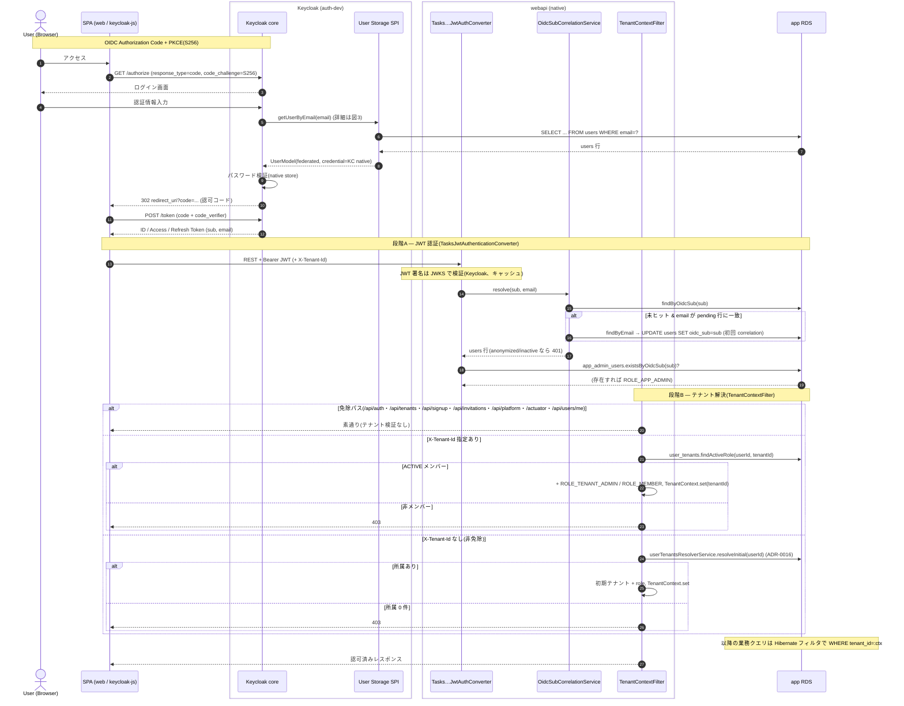
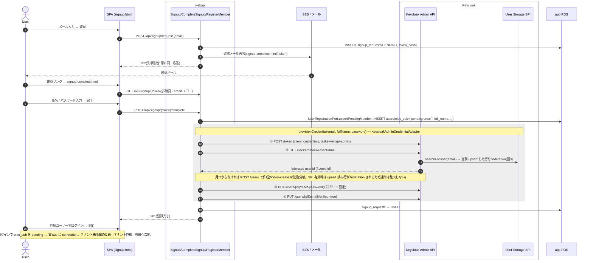
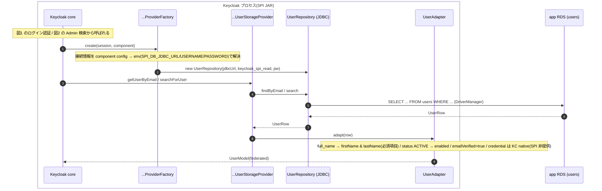
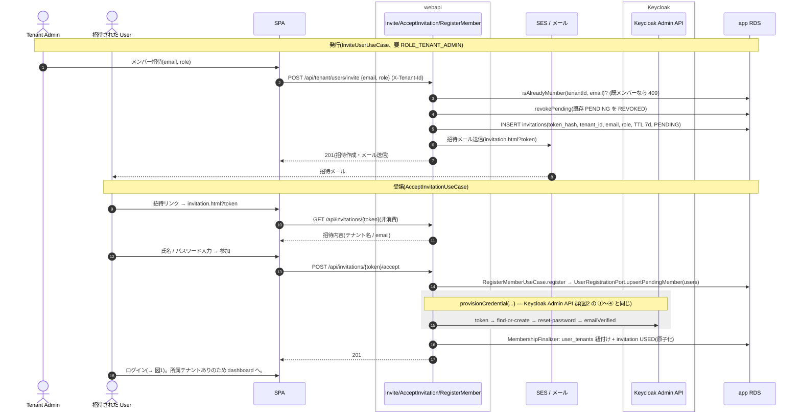

# Keycloak 連携機能 シーケンス図

Keycloak と連携する主要フローの実装シーケンス。関連 ADR: [ADR-0006](../adr/0006-keycloak-user-storage-spi.md)(User Storage SPI federation)/ [ADR-0040](../adr/0040-onboarding-registration-and-credential-provisioning.md)(オンボーディング + credential provisioning)/ [ADR-0017](../adr/0017-invitation-and-credential-recovery-flows.md)(招待・資格回復)/ [ADR-0041](../adr/0041-post-deploy-dev-e2e-and-email-verification.md)(dev E2E)。

前提となる識別モデル(#862 で全環境に配線):

- **app `users` テーブルが SoT**。Keycloak は **User Storage SPI**(`tasks-webapi-user-storage`)で `users` を read-only federation する(接続は read-only DB ユーザー `keycloak_spi_read`)。
- **credential(パスワード)は Keycloak が SoT**(ADR-0006 §3.3)。SPI は `CredentialInputValidator` を実装せず、資格情報は Keycloak native store が持つ。
- federated ユーザーの JWT `sub` は `f:{component-id}:{users.id}` 形式。プロフィール(`firstName`/`lastName`/`email`)は SPI が `users.full_name`/`email` から供給する。
- dev/local のシード4ユーザーは realm-export のローカルユーザーとして共存し、ログインでローカルが優先(shadow)される。
- ブラウザ SPA(`web`)は **keycloak-js**(`onLoad:'login-required'`, `pkceMethod:'S256'`, flow=standard)で **OIDC Authorization Code フロー + PKCE(S256)** を使う。

図中の `box` は**同一プロセス**を表す(SPI は別サービスではなく Keycloak プロセス内の provider、`Tasks…Converter`/`OidcSubCorrelationService`/`TenantContextFilter` は webapi 内部クラス)。

---

## 1. ログイン → JWT 認証 → oidc_sub correlation → ロール解決

SPA が Keycloak で **認可コードフロー + PKCE** で認証し、得た JWT を webapi に提示。webapi は **段階A(JWT 認証)**と**段階B(TenantContextFilter)**で app RDS を複数回参照して principal と権限を確定する。

参照する app RDS テーブルは **`users`(correlation)/ `app_admin_users`(SaaS Admin)/ `user_tenants`(テナントロール + メンバー検証)** の3つ。

---

## 2. 会員登録(セルフサインアップ, double opt-in)

`POST /api/signup/request` → 確認メール → `POST /api/signup/{token}/complete` で users 行 upsert + Keycloak credential provisioning。登録直後はテナント未所属(ADR-0040 §3.5)。

`provisionCredential(...)` は **アプリの1メソッド**(`KeycloakAdminCredentialAdapter`)で、その内部で Keycloak Admin REST を複数回呼ぶ(下図の枠内)。

Keycloak 失敗時は signup トークンを消費しない(再試行で回復、ADR-0040 §3.5)。列挙耐性のためメール送信失敗は握りつぶす。

---

## 3. User Storage SPI federation(図1・図2 の `KC→SPI` の内部展開)

**単独のフローではなく、図1 のログイン認証 / 図2 の Admin ユーザー検索から Keycloak が呼ぶ内部経路のズームイン**(だから利用者は登場しない)。`keycloak_spi_read`(SELECT のみ)で app `users` に JDBC 接続し、`UserModel` を組み立てる。

`priority=0` / `cachePolicy=NO_CACHE`。realm への component 登録は realm-export に含む(CI/local は fresh import で有効)が、deployed は `--import-realm` IGNORE_EXISTING のため Admin API で登録する。

---

## 4. 招待(発行 → 受諾)

Tenant Admin が招待を**発行**(`InviteUserUseCase`)し、招待された利用者が**受諾**する(`AcceptInvitationUseCase`)。受諾は会員登録プリミティブを共有し、テナント紐付け + トークン消費を原子化する(ADR-0040 §3.5・ADR-0017、#831)。

---

## 参考

- [ADR-0006](../adr/0006-keycloak-user-storage-spi.md) / [ADR-0040](../adr/0040-onboarding-registration-and-credential-provisioning.md) / [ADR-0017](../adr/0017-invitation-and-credential-recovery-flows.md) / [ADR-0041](../adr/0041-post-deploy-dev-e2e-and-email-verification.md)
- 実装: `security/adapter/web/TasksJwtAuthenticationConverter` / `security/adapter/web/TenantContextFilter` / `security/usecase/OidcSubCorrelationService` / `tenant/adapter/web/{SignupController,InvitationController,TenantMemberController}` / `tenant/usecase/{InviteUserUseCase,AcceptInvitationUseCase}` / `user/usecase/RegisterMemberUseCase` / `user/adapter/external/KeycloakAdminCredentialAdapter` / `keycloak/`(SPI)
- dev 配線の詳細(SPI_DB_*、SSM、DB ユーザー、component 追加手順)は `infra/environments/dev/rds.tf` と ADR-0006/0040。
