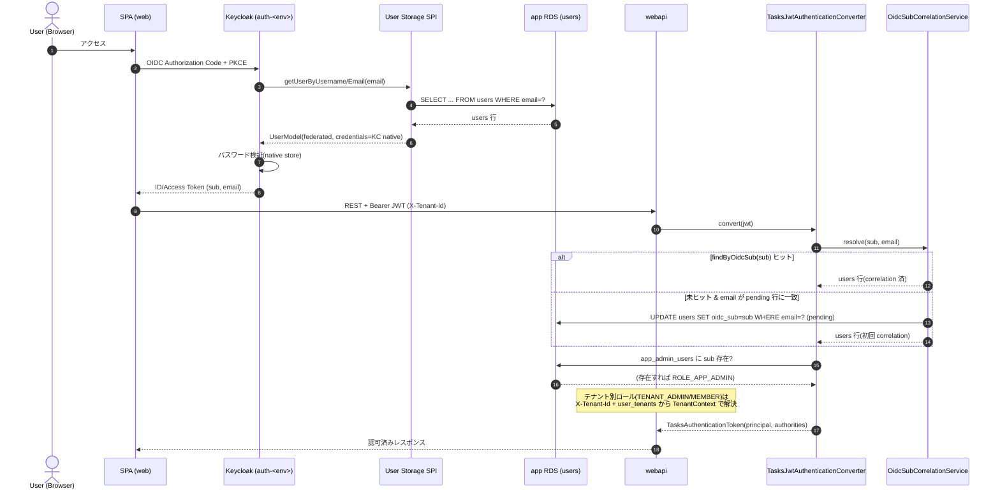
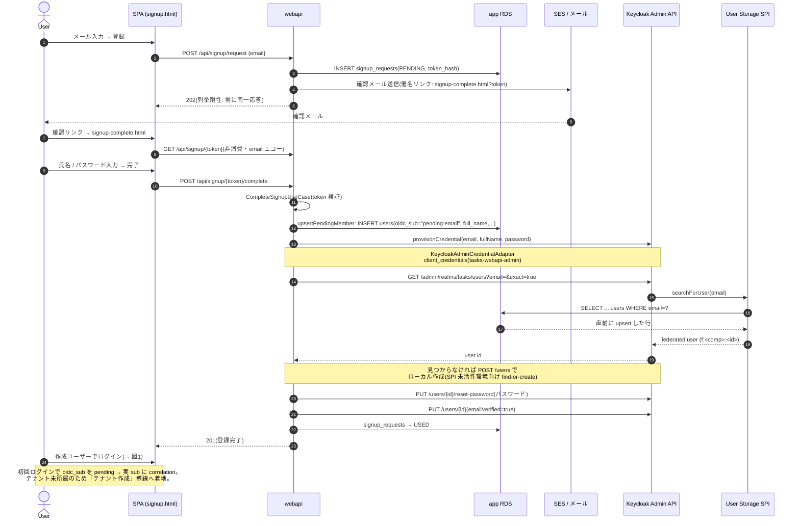
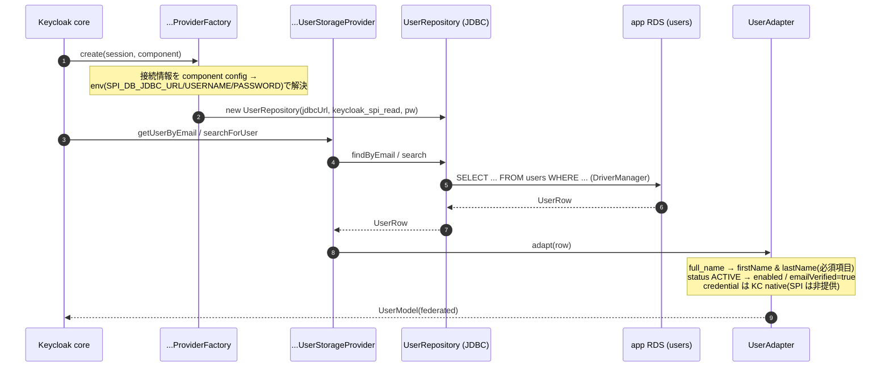
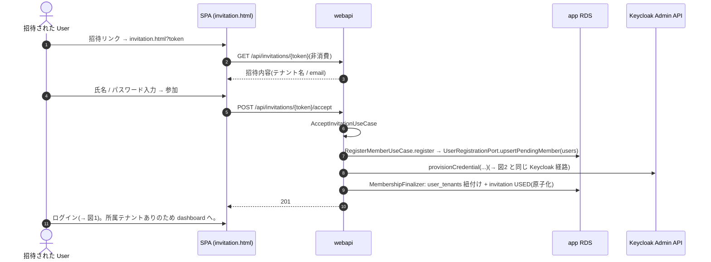

# Keycloak 連携機能 シーケンス図

Keycloak と連携する主要フローの実装シーケンス。関連 ADR: [ADR-0006](../adr/0006-keycloak-user-storage-spi.md)(User Storage SPI federation)/ [ADR-0040](../adr/0040-onboarding-registration-and-credential-provisioning.md)(オンボーディング + credential provisioning)/ [ADR-0041](../adr/0041-post-deploy-dev-e2e-and-email-verification.md)(dev E2E)。

前提となる識別モデル(#862 で全環境に配線):

- **app `users` テーブルが SoT**。Keycloak は **User Storage SPI**(`tasks-webapi-user-storage`)で `users` を read-only federation する(接続は read-only DB ユーザー `keycloak_spi_read`)。
- **credential(パスワード)は Keycloak が SoT**(ADR-0006 §3.3)。SPI は `CredentialInputValidator` を実装せず、資格情報は Keycloak native store が持つ。
- federated ユーザーの JWT `sub` は `f:<component-id>:<users.id>` 形式。プロフィール(`firstName`/`lastName`/`email` 等)は SPI が `users.full_name`/`email` から供給する。
- dev/local のシード4ユーザーは realm-export のローカルユーザーとして共存し、ログインでローカルが優先(shadow)される。

---

## 1. ログイン → JWT 認証 → oidc_sub correlation → ロール解決

SPA が Keycloak で OIDC 認証(PKCE)し、取得した JWT を webapi に提示。webapi は `sub` から app ユーザーを解決し、権限を確定する。

`isAnonymized()` / `isInactive()` の場合は認証を拒否する(`UserAnonymizedException` / `UserInactiveException`)。

---

## 2. 会員登録(セルフサインアップ, double opt-in)

`POST /api/signup/request` → 確認メール → `POST /api/signup/{token}/complete` で users 行 upsert + Keycloak credential provisioning。登録直後はテナント未所属(ADR-0040 §3.5)。

Keycloak 失敗時は signup トークンを消費しない(再試行で回復、ADR-0040 §3.5)。列挙耐性のためメール送信失敗は握りつぶす。

---

## 3. User Storage SPI federation(Keycloak → app users 読取経路)

Keycloak が federated ユーザーを解決する内部経路。`keycloak_spi_read`(SELECT のみ)で app `users` に JDBC 接続する。

`priority=0` / `cachePolicy=NO_CACHE`。realm への component 登録は realm-export に含む(CI/local は fresh import で有効)が、deployed は `--import-realm` IGNORE_EXISTING のため Admin API で登録する。

---

## 4. 招待受諾(テナントへの参加, Flow A)

`GET /api/invitations/{token}` で内容表示 → `POST` で受諾。新規ユーザーは会員登録プリミティブを共有し、テナント紐付け + トークン消費を原子化する(ADR-0040 §3.5、#831)。

---

## 参考

- [ADR-0006](../adr/0006-keycloak-user-storage-spi.md) / [ADR-0040](../adr/0040-onboarding-registration-and-credential-provisioning.md) / [ADR-0041](../adr/0041-post-deploy-dev-e2e-and-email-verification.md)
- 実装: `security/adapter/web/TasksJwtAuthenticationConverter` / `security/usecase/OidcSubCorrelationService` / `tenant/adapter/web/SignupController` / `user/usecase/RegisterMemberUseCase` / `user/adapter/external/KeycloakAdminCredentialAdapter` / `keycloak/`(SPI)
- dev 配線の詳細(SPI_DB_*、SSM、DB ユーザー、component 追加手順)は `infra/environments/dev/rds.tf` と ADR-0006/0040。
