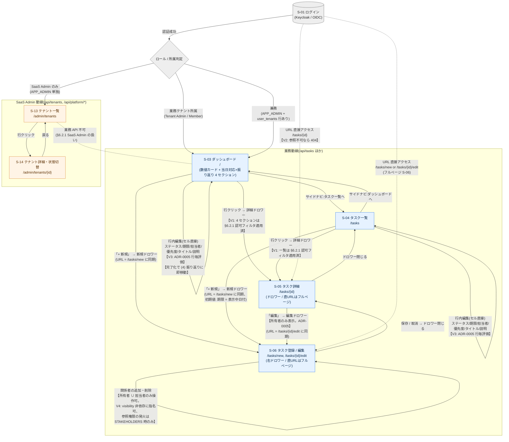

# 画面遷移図とサイトマップ(初版)

タスク管理システム(tasks-webapi)

Version 1.0

2026-06-01

作成者: 開発チーム

## 改訂履歴

| 版数 | 改訂日 | 改訂内容 | 改訂者 |
|---|---|---|---|
| 1.0 | 2026-06-01 | Issue #150 / 親 Issue #149(Sprint 0 画面設計)に基づき新規作成。コア 4 画面(ダッシュボード / タスク一覧 / タスク詳細 / テナント管理)のサイトマップと Mermaid 遷移図を初版として整備。Sprint 0 方向性レビューを反映し、ダッシュボード「当日対応 + 振り返り」4 セクション・行内編集・右ドロワー方針を組み込み | 開発チーム |
| 1.1 | 2026-06-01 | §6.1 派生 4 番(A-14 PUT の部分更新化議論)の結論を Issue #329 で確定(案 (1) = `PATCH /api/tasks/{id}` 新設 + A-14 PUT 廃止)。派生 4 番に結論と派生 Issue 番号を back-ref として追記、§0 の「派生 4 の結論次第で」を「派生 4 の結論で確定した」に更新 | 開発チーム |

## 目次

- [改訂履歴](#改訂履歴)
- [0. 本書の位置付け](#0-本書の位置付け)
- [1. 用語と表記](#1-用語と表記)
- [2. サイトマップ(画面一覧)](#2-サイトマップ画面一覧)
- [3. 画面遷移図(Mermaid)](#3-画面遷移図mermaid)
- [4. visibility 区分が遷移に効く箇所](#4-visibility-区分が遷移に効く箇所)
- [5. UX 方針(本初版で確定したもの)](#5-ux-方針本初版で確定したもの)
- [6. スコープ外と次ステップ](#6-スコープ外と次ステップ)

## 0. 本書の位置付け

- 親 Issue #149(Sprint 0 画面設計 初版)のサブ Issue #150 の成果物。Sprint 1 以降の画面実装スプリントが本書だけで着手判断できる粒度を狙う初版。
- スコープは Issue #150 が指定する **コア 4 画面**(ログイン後ランディング = ダッシュボード / タスク一覧 / タスク詳細(参照・編集・関係者追加) / テナント管理(SaaS Admin 専用))。
- 関連 SSOT:
  - `docs/specs/基本設計書.md` v1.4.8 §3.1 画面遷移図(旧 ASCII 版)/ §3.2 画面一覧 / §3.3 主要画面仕様 / §4.2 タスクテーブル定義 / §6.2 認証・認可
  - `docs/adr/0005-task-authorization-three-roles.md`(ADR-0005)タスク認可 3 役割評価
  - `api/openapi.yaml` v1.4.5(画面項目 ↔ API 突き合わせは #153 の責務)
- 本書と基本設計書 §3.1 / §3.2 / §6.2.x との間に矛盾が生じた場合は、認可判定は ADR-0005 を、API 契約は OpenAPI を、それぞれ SSOT とする。
- 本初版の §5 で確定した UX 方針(ダッシュボード「当日対応 + 振り返り」4 セクション / 行内編集 / 右ドロワー / S-06 再定義 / `tasks.completed_at` 新設)は基本設計書 §3.3 / §4.2 / §4.4(および派生 4 の結論で確定した §5.1 API 一覧)の改訂を伴うが、本 PR では基本設計書側を触らず、派生 Issue を起票して別 PR で同期する(§6 末尾を参照)。

## 1. 用語と表記

| 表記 | 意味 |
|---|---|
| ロール(設計書表記) | `SaaS Admin` / `Tenant Admin` / `Member`(基本設計書 §6.2)。Keycloak realm role / `user_tenants.role` 上の内部コードはそれぞれ `APP_ADMIN` / `TENANT_ADMIN` / `MEMBER` |
| visibility | タスクの公開範囲。`TENANT`(テナント全員)/ `STAKEHOLDERS`(所有者 ∪ 担当者 ∪ 関係者)/ `PRIVATE`(所有者 ∪ 担当者)。ADR-0005 §3 |
| 認可フィルタ | 基本設計書 §6.2.1 のタスクごとの認可ルール(参照 / 編集 / ステータス / visibility 変更 / 関係者編集) |
| 404 / 403 | 参照不可は **404**(リソース存在を秘匿、NIST AC-4)、編集系の権限不足は **403**(基本設計書 §6.2.3) |
| S-XX | 基本設計書 §3.2 と同じ画面 ID |
| **行内編集 (inline edit)** | 一覧・リスト行のセルクリックでその場で項目を編集する UI。本書では §5 で確定した 6 項目(ステータス / 期限 / 担当者 / 優先度 / タイトル / 説明)を対象とする |
| **右ドロワー** | 画面右からスライドする縦長パネル。URL 同期あり(タスク新規は `/tasks/new`、編集は `/tasks/{id}/edit` と同期)。S-06 の UI 実体 |
| **当日対応 + 振り返りリスト** | ダッシュボード(S-03)に表示する個人ワークリスト。4 セクション(期限超過 / 今日やること / これから / 今日やったこと)で構成。条件は §5.1 で定義 |
| **`completed_at`** | `tasks` テーブルに新設する完了 datetime カラム(Nullable)。ステータスが完了に遷移した瞬間に `now()` セット、非完了に戻ったら NULL クリア。詳細は §5.1 / §6.1 派生 Issue 5 番 |

## 2. サイトマップ(画面一覧)

本書のスコープは Issue #150 のコア 4 画面群。S-13 / S-14 はテナント管理(SaaS Admin 専用)機能群として 1 つの画面群にまとめる。S-05(詳細閲覧)と S-06(編集)は本書 §5 の方針で UI 上は同じ右ドロワーに統合されるが、画面 ID は基本設計書 §3.2 と整合させる。

| 画面 ID | 名称 | URL パス案 | 主目的 | アクセス可能ロール |
|---|---|---|---|---|
| S-03 | ダッシュボード(ログイン後ランディング) | `/` | ログイン直後のホーム。**(a) 数値カード**(当日件数 / 期限切れ件数 / 自分の進捗)+ **(b)「当日対応 + 振り返り」リスト**(4 セクション、行内編集対応、ドロワー編集に拡張可。詳細は §5.1) | `Tenant Admin` / `Member`(業務テナント所属が前提)。`SaaS Admin` 単独(`APP_ADMIN` のみで `user_tenants` に行を持たない)は業務 API 不可のため到達不可 |
| S-04 | タスク一覧 | `/tasks` | 期限切れ常時表示 + 日付ピッカーで選択日分のタスク一覧。**行内編集** + **新規追加ドロワー**併設。フィルタ・並び替え・ページングは S-03 リストよりも本格的 | `Tenant Admin` / `Member` |
| S-05 | タスク詳細(参照) | `/tasks/{id}` | 1 件のタスク内容表示 / 関係者一覧表示 / 操作起点。**S-03・S-04 から行クリックした場合は右ドロワーで開く**。URL 直接アクセス時はフルページ表示にフォールバック(ディープリンク・通知メールリンク・タブ復元のため) | `Tenant Admin` / `Member` のうち §6.2.1 参照ルールを通過するユーザー |
| S-06 | タスク登録 / 編集 | `/tasks/new`, `/tasks/{id}/edit` | **URL 単位の互換窓口 + 右ドロワー UI 実装**。新規・編集兼用画面で、ドロワーが UI 実体。フルページ表示は URL 直接アクセス時のフォールバック。編集可能項目は ADR-0005 の 3 役割評価(所有者 = 全項目 / 担当者 = ステータス・関係者のみ / その他 = 読み取り専用) | `Tenant Admin` / `Member`(編集可否は ADR-0005 で判定) |
| S-13 | テナント一覧(SaaS Admin) | `/admin/tenants` | SaaS Admin 専用。テナント一覧 + 状態フィルタ + 名前検索 + ページング | `SaaS Admin` のみ。`Tenant Admin` / `Member` は 403(`hasRole('APP_ADMIN')` 不通過) |
| S-14 | テナント詳細・状態切替(SaaS Admin) | `/admin/tenants/{id}` | SaaS Admin 専用。テナント名編集 / 状態切替(`ACTIVE` ↔ `SUSPENDED`)/ 所属ユーザー数・タスク数の表示 | `SaaS Admin` のみ |

> 補足(参考、本書スコープ外の画面):S-01 ログイン(`/login`)/ S-02 OIDC コールバック(`/callback`)/ S-07 テナント切替(`/tenants/select`)/ S-11 テナント新規作成(`/tenants/new`)/ S-15 テナント運営者向けダッシュボード(`/tenant/dashboard`)などは基本設計書 §3.2 を参照。下記 Mermaid 図では文脈保持のため一部を補助ノードとして登場させるが、本書サイトマップの行はコア 4 画面群に限定する。

> ロール × 画面の **操作レベルの権限マトリクス**(編集 / 削除 / 状態変更 / 集計閲覧 などの一覧)はサブ Issue #151 の成果物として別ファイルに整備する。本書ではサイトマップ行の「アクセス可能ロール」までを担当する。

## 3. 画面遷移図(Mermaid)

### 図の読み方

- 実線の矢印 = 通常の UI 操作による遷移(ナビ・ボタン・行アクション)。点線 = URL 直接アクセスや論理的な隣接関係(物理的なリンクは張らない)。
- 同一画面内の自己ループ(S-03 → S-03、S-04 → S-04、S-06 → S-06)は **行内編集 / インラインアクション** を表す。画面遷移なしで API 呼び出し → 該当行 / 項目の再描画。S-03 のループでは特に **完了化による (4) 今日やったこと セクションへの移動** が発生する(§5.1 参照)。
- `S-05` と `S-06` を行クリック / 編集ボタンで開く場合、UI 実体は **右ドロワー**(URL は `/tasks/{id}` / `/tasks/{id}/edit` に同期)。URL 直接アクセス時のみフルページ表示にフォールバックする(タブ復元・通知メールリンクなど)。
- ロール分岐は **テナント軸の所属**(`user_tenants.role`)を基準に決まる。`APP_ADMIN` のみで業務テナント未所属のユーザーは、業務動線(S-03 / S-04 / S-05 / S-06)に到達できない(基本設計書 §6.2.1「SaaS Admin の扱い」)。
- 兼務ユーザー(`APP_ADMIN` + `user_tenants` 行あり)は、`X-Tenant-Id` で業務テナントを選択している間はテナント軸ロールで業務動線に入り、`/admin/*` 配下を開いた瞬間に `APP_ADMIN` で SaaS Admin 動線に切り替わる。両動線は **画面遷移としては直結しない**(S-13 ⇔ S-03 のエッジを張らない)ことで、認可境界を視覚的にも明示する。

## 4. visibility 区分が遷移に効く箇所

ADR-0005 で確定したとおり、visibility(`TENANT` / `STAKEHOLDERS` / `PRIVATE`)は **画面の到達可否**ではなく **画面内のデータ可視範囲と操作可否**に効く。本書ではどの遷移点で visibility 判定が走るかを `V1` 〜 `V5` の注釈タグで明示する(図中の `【V*: ...】` ラベルと対応)。

| 注釈 | 効きどころ | 適用ロジック | 関連 |
|---|---|---|---|
| **V1** | S-03「当日対応 + 振り返り」リスト 4 セクション / S-04 タスク一覧の行表示 | リスト表示前に §6.2.1 の参照ルールを `Hibernate Filter` + 認可フィルタで適用。`TENANT` = 同テナント全員 / `STAKEHOLDERS` = 所有者 ∪ 担当者 ∪ `task_stakeholders` 登録者 / `PRIVATE` = 所有者 ∪ 担当者。N+1 防止のため `findTaskIdsByUser` の事前一括フェッチ必須(基本設計書 §6.2.1 末尾の実装注意) | §6.2.1 / ADR-0005 §3.1 |
| **V2** | S-05 タスク詳細(ドロワー or フルページ)への直接 URL アクセス | 参照ルールを通過しないユーザーには **404 Not Found**(NIST AC-4 整合、リソース存在の秘匿)。403 ではない | §6.2.3 / §6.2.1 |
| **V3** | S-03 / S-04 行内編集 + S-06 ドロワー編集の項目操作可否 | 編集可否は **3 役割評価** で決まり visibility そのものには直接連動しない。所有者 = 全項目 / 担当者 = ステータス + 関係者リスト / その他 = 読み取り専用。編集不可ユーザーには行内編集セルを **無効表示**(クリック不可、ツールチップで理由表示)。`公開範囲(visibility)変更` は **所有者のみ**(`PATCH /api/tasks/{id}/visibility` = A-17、ドロワー内のみ操作可、行内編集対象外) | §3.3.2 / ADR-0005 §3.2 |
| **V4** | S-06 ドロワー内の関係者追加・削除 | 操作可は **所有者 ∪ 担当者**。指名自体は visibility 非依存に行えるが、関係者として **参照権限が発火するのは `visibility = STAKEHOLDERS` のときのみ**(ADR-0005 §3.4)。`PRIVATE` の関係者は登録できても参照不可、`TENANT` の関係者は登録するまでもなく全員参照可。関係者編集は **ドロワー内に限定**(行内編集対象外) | ADR-0005 §3.4 / §6.2.1 |
| **V5** | S-03 数値カード集計 + S-03「当日対応 + 振り返り」リスト 4 セクション | いずれも §6.2.1 の参照認可フィルタ通過後のタスク集合に対して行う。`PRIVATE` = 所有者・担当者のみ加算 / `STAKEHOLDERS` = 所有者 ∪ 担当者 ∪ 関係者にのみ加算 / `TENANT` = テナント全員に同一件数で加算。Tenant Admin であっても特権なし(ADR-0005)。リストの絞り込みは §5.1 のとおり、認可通過後にさらに「自分関連 + 4 セクション条件(期限超過 / 今日未完了 / 今日 < 期限 ≤ 今日+3日 未完了 / 本日完了)」で絞る | §6.2.2.1 |

> **テナント管理(S-13 / S-14)に visibility は効かない**: テナント管理は SaaS Admin 専用のテナント運営軸の機能で、業務タスクの可視性とは独立(§6.2.1「SaaS Admin の扱い」)。S-13 / S-14 は visibility 判定を実行せず、`hasRole('APP_ADMIN')` のみで認可される。

> **遷移上の判定タイミング**: V1 / V5 は「画面ロード時の一覧 / 集計クエリ」、V2 は「画面ロード時のリソース取得」、V3 / V4 は「画面内の操作ボタン表示・操作 API 呼び出し」のタイミングで判定される。クライアント側で UI を出し分けても、サーバ側で必ず同等の認可判定が走る(NIST 多層防御)。

## 5. UX 方針(本初版で確定したもの)

Sprint 0 方向性レビューで以下を確定した。基本設計書 §3.3 / §4.2 / §4.4 / §5.1 の改訂は派生 Issue を起票して別 PR で同期する(§6 末尾参照)。

### 5.1 ダッシュボード(S-03)に「当日対応 + 振り返り」リストを乗せる

- **目的**: 「今日やらないといけないこと」と「今日やったこと」が S-03 で **大体完結** する状態を作る。S-04 への遷移を強制せずに、当日の業務遂行と振り返りをスムーズにする。
- **共通の前提**(すべてのセクションに適用される AND 条件):
  1. `visibility` の §6.2.1 参照認可フィルタを通過(V1)
  2. 自分が **所有者** または **担当者** である
- **セクション分け**(以下 4 セクションの OR 結合で対象タスクを抽出、画面上もこの順で縦に並べる):

  | # | セクション | 抽出条件 | ソート順 | 視覚強調 | 用途 |
  |---|---|---|---|---|---|
  | (1) | **期限超過** | `期限 < 今日` AND `ステータス ≠ 完了` | 期限 ASC → 優先度 DESC | 赤ボーダー / 赤背景タグ | 最優先対応 |
  | (2) | **今日やること** | `期限 = 今日` AND `ステータス ≠ 完了` | 優先度 DESC → 作成日 ASC | 黄 / オレンジ強調 太字 | 当日対応 |
  | (3) | **これから(明日・明後日)** | `今日 < 期限 ≤ 今日 + 3 日` AND `ステータス ≠ 完了` | 期限 ASC → 優先度 DESC | 通常表示 | 着手リードタイム確保 |
  | (4) | **今日やったこと(振り返り)** | `ステータス = 完了` AND `completed_at の日付部分 = 今日`(期限の日付は問わない) | `completed_at` DESC(最新の完了が先頭) | 打消し線 + グレー / チェックアイコン | 振り返り |

- **3 日間の根拠**: 「明日が期限のタスクは当日知るのでは遅い場合がある」(着手リードタイム)を踏まえ、今日 + 明日 + 明後日をカバー。Phase 2 で個人通知設定と統合して可変化する余地を残す。
- **本日完了の識別**: `tasks.completed_at`(datetime、Nullable)を新設し、ステータスが完了へ遷移した瞬間にサーバ側で `now()` をセット、完了から他ステータスへ戻ったら NULL にクリアする(再完了で新しい datetime 値に書き換わる)。詳細は §6.1 派生 Issue 5 番。
- **数値カード**(従来通り)と **当日対応 + 振り返りリスト**(本初版で追加)は同じ画面上に共存。数値カードの集計対象は §6.2.2.1 のとおり全タスク(認可通過後)で変わらない。リストは上記 4 セクションの絞り込みでさらに狭めたサブセット。
- **行内編集の挙動(セクション間移動)**: 未完了 → 完了 の遷移を行内編集(チェック / ステータスプルダウン)で行うと、対象タスクが **(2) 今日やること** または **(1) 期限超過** から外れて即座に **(4) 今日やったこと** セクション先頭に移動する(楽観的 UI 更新 + サーバ応答で確定)。逆方向の遷移(完了 → 未完了)も同様にセクション間で移動。期限を行内編集で変更した場合も同じく所属セクションが切り替わる。
- **対応 API**: §5.1 のリスト取得は 1 回の `GET /api/tasks` で 4 セクション分を一括取得し、クライアント側で振り分け。クエリ案: `GET /api/tasks?ownerOrAssignee=me&dashboardScope=today` 相当でサーバ側に当日対応 + 振り返りスコープを認識させる。具体的なクエリパラメータ・レスポンス形状は #153 で OpenAPI と突き合わせる。

### 5.2 行内編集(ダッシュボード当日対応リスト / タスク一覧)

- **対象画面**: S-03「当日対応 + 振り返り」リスト 4 セクション / S-04 タスク一覧
- **編集可能項目**(セルクリック → その場で編集):
  - **ステータス**(プルダウン or チェック)→ `PATCH /api/tasks/{id}/status`(A-16)。**所有者 ∪ 担当者**。完了遷移時は §5.1 に従ってセクション間移動が発生
  - **期限**(date picker)→ A-14 PUT 相当(部分更新の API 拡張は §6 末尾の議論ネタ)。**所有者のみ**。S-03 では期限変更で所属セクションが切り替わる
  - **担当者**(プルダウン)→ A-14 相当。**所有者のみ**
  - **優先度**(プルダウン)→ A-14 相当。**所有者のみ**
  - **タイトル**(セル内テキスト入力)→ A-14 相当。**所有者のみ**
  - **説明**(ポップオーバー型 textarea。行高を超えるためインラインではなくセルクリックで小さなオーバーレイ展開)→ A-14 相当。**所有者のみ**
- **行内編集の対象外項目**(ドロワー編集のみ):
  - **公開範囲(visibility)**: `PATCH /api/tasks/{id}/visibility`(A-17)。所有者のみ。誤操作リスクが大きいためドロワー内のみ
  - **関係者リスト**: A-19 / A-20。所有者 ∪ 担当者。複数選択 UI が必要なためドロワー内のみ
  - **論理削除**: A-15。所有者のみ。確認ダイアログを伴うためドロワー内のみ
- **認可不可ユーザーの表示**: V3 のとおり「無効表示 + ツールチップで理由」。クリックしてもサーバ側で 403 を返すが、クライアント側でも UI 出し分けで操作不能にする(NIST 多層防御)。
- **UI 詳細**(セルクリック挙動 / 確定キー / バリデーション表示 / セクション間移動アニメーションなど)は **デザインシステム素案 #154** の成果物として決定する。本書では編集対象項目セットと挙動方針の確定までを担当する。

### 5.3 新規・詳細編集は右ドロワー(URL 同期あり)

- **UI 形態**: 画面右からスライドする縦長ドロワーパネル。S-03 / S-04 / S-05 のどこから開いてもドロワーが UI 実体となる。
- **URL 同期**:
  - 新規追加: `/tasks/new` に同期(`history.pushState`)。ドロワーを閉じると元画面の URL に戻る。
  - 編集: `/tasks/{id}/edit` に同期。
  - 詳細閲覧: `/tasks/{id}` に同期(S-05 は閲覧専用ドロワー → 編集ドロワーに切替)。
- **直接 URL アクセス時のフォールバック**: `/tasks/new` / `/tasks/{id}/edit` / `/tasks/{id}` を直接開いた場合は **フルページ表示**。ブラウザのタブ復元・ブックマーク・メール通知のリンク・新しいタブで開く操作などで離脱せず到達できる。
- **S-06 の再定義**: S-06 は「URL 単位の互換窓口 + 右ドロワー UI 実装」。URL とフルページ表示としての存在は維持し、ドロワー実装と同じフォームコンポーネントを共有する。

### 5.4 認可と編集 UI の対応表(本初版確定の操作だけ抜粋)

| 操作 | API | 認可主体 | 行内編集 | ドロワー編集 |
|---|---|---|---|---|
| ステータス変更 | A-16 | 所有者 ∪ 担当者 | ✓ | ✓ |
| 期限変更 | A-14 | 所有者のみ | ✓ | ✓ |
| 担当者変更 | A-14 | 所有者のみ | ✓ | ✓ |
| 優先度変更 | A-14 | 所有者のみ | ✓ | ✓ |
| タイトル変更 | A-14 | 所有者のみ | ✓ | ✓ |
| 説明変更 | A-14 | 所有者のみ | ✓(ポップオーバー) | ✓ |
| 公開範囲変更 | A-17 | 所有者のみ | — | ✓ |
| 関係者追加 | A-19 | 所有者 ∪ 担当者 | — | ✓ |
| 関係者削除 | A-20 | 所有者 ∪ 担当者 | — | ✓ |
| 論理削除 | A-15 | 所有者のみ | — | ✓(確認ダイアログ) |

> 操作レベルのロール × 画面 × visibility 完全マトリクスは #151 で別途整備する。本表は **本書で確定した UX 方針** が指す範囲のみを抜粋している。

## 6. スコープ外と次ステップ

- 本書のスコープ外で、Sprint 0 の他サブ Issue が担当する成果物:
  - **#151 ロール × 画面 権限マトリクス整理**:操作レベル(編集 / 削除 / ステータス / 公開範囲 / 関係者追加 / 集計 / 招待 / 監査ログ参照 等)× 画面 × ロール × visibility の網羅マトリクス
  - **#152 Claude Design でコア 4 画面の方向性検証**:ハイファイ手前のレイアウト・項目構成の方向性確定
  - **#153 OpenAPI v1.4.5 と画面項目の突き合わせ**:画面入力・表示項目を A-XX API のスキーマと突き合わせ、ギャップ Issue 起票
  - **#154 デザインシステム素案(Bootstrap 5 ベース)**:タイポ / カラー / 余白 / コンポーネント(行内編集セル / ポップオーバー / ドロワー / セクション間移動アニメーションの共通基盤)
- 認証関連画面(S-01 ログイン / S-02 OIDC コールバック / S-07 テナント切替 / S-11 テナント新規作成)は親 Issue #149 の Out of Scope。Sprint 1 以降に別 Issue で扱う。
- ユーザー設定 / 通知設定 / エラー画面パターン / S-15 テナント運営者向けダッシュボードも本書のスコープ外。基本設計書 §3.2 / §3.3.4 を参照。

### 6.1 本初版が誘発する派生 Issue(別 PR で同期予定)

本書 §5 の UX 方針は基本設計書 §3.3 / §4.2 / §4.4 / §5.1 の改訂を伴うが、本 PR では基本設計書側を触らず、以下を派生 Issue として起票してから別 PR で同期する(memory `feedback_issue_first_and_batched_intake` に従う)。

1. **基本設計書 §3.3.1 タスク一覧の改訂**: 行操作に行内編集(6 項目)を追記、新規追加遷移をドロワー基準に書き換え
2. **基本設計書 §3.3.2 タスク登録/編集画面の改訂**: S-06 を「URL 単位の互換窓口 + 右ドロワー UI 実装」に再定義、フルページ表示を直接 URL アクセス時のフォールバックと位置付け
3. **基本設計書 §3.3.3 ダッシュボード画面の改訂**: 数値カードに加えて「当日対応 + 振り返り」リスト 4 セクション(条件 = §5.1)を追加、行内編集と新規追加ドロワー導線を記述。完了化によるセクション間移動の挙動も明記
4. **OpenAPI A-14 PUT の部分更新化の議論**: 行内編集多用時は `PUT /api/tasks/{id}`(全項目)よりも `PATCH /api/tasks/{id}`(部分更新)の方が UX・帯域・コンフリクト面で有利。A-16 / A-17 で既に個別 PATCH があるが、期限・担当者・優先度・タイトル・説明の 5 項目を一括カバーする PATCH が必要かを **Issue #329 で議論 → 案 (1) 採用で確定(2026-06-01)= `PATCH /api/tasks/{id}` 新設 + A-14 PUT 廃止**。後続として (i) `JsonNullable<T>` を採用する DTO 規約 ADR、(ii) ETag / If-Match 楽観ロック ADR(`tasks.version` カラム新設)、(iii) 監査ログ field-by-field 差分の方式選定 ADR、(iv) OpenAPI v1.5.x 反映(PUT 廃止 + PATCH 新設) を派生 Issue として独立起票する(派生 Issue 番号は Issue #329 末尾の「結論と後続」セクションを参照)。本書本文の §5.1 API 一覧改訂は (iv) の OpenAPI 反映 PR と同期して行う
5. **`tasks.completed_at` カラム新設**: §5.1 (4) 今日やったこと(振り返り)セクションの判定基盤、および基本設計書 §3.3.3 数値カード「本日完了件数」の集計基盤。`completed_at DATETIME NULL` を `tasks` テーブルに追加し、ステータス完了遷移時にサーバ側で `now()` セット / 非完了に戻ったら NULL クリア。影響範囲は Flyway マイグレーション / Entity / Domain `Task` モデル / `ChangeTaskStatusUseCase`(A-16) / `UpdateTaskUseCase`(A-14)/ Task DTO レスポンス / 集計 SQL(リスト (4) 抽出条件 + 数値カード「本日完了件数」の両方)。インデックスは `(tenant_id, completed_at)` の複合を追加(振り返りクエリ用)。`@PrePersist`/`@PreUpdate` で隠蔽するか UseCase で明示セットするかは ADR 候補

本書は基本設計書 §3.1 の ASCII 画面遷移図を Mermaid + サイトマップに置き換える初版。基本設計書 §3.1 側の改訂(本書へのリンク化 or 抜粋差し替え)は上記 1〜3 の派生 Issue とまとめて同一 PR で行う。5 番(`completed_at`)は DDL + UseCase + DTO まで関与するため別 Issue として独立起票し、PR の依存関係は **blocks: 5 → 3**(5 が 3 を blocks する。基本設計書 §3.3.3 改訂で「振り返りセクション」と数値カード「本日完了件数」を記述するには `completed_at` DDL が前提)で設定する想定。
